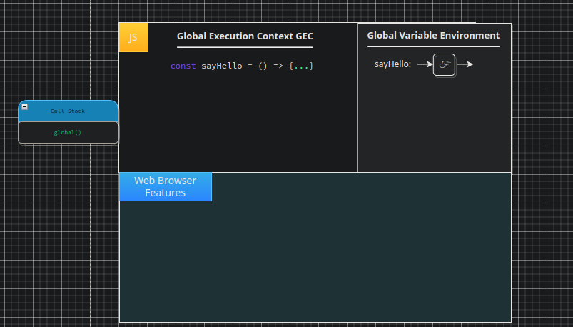
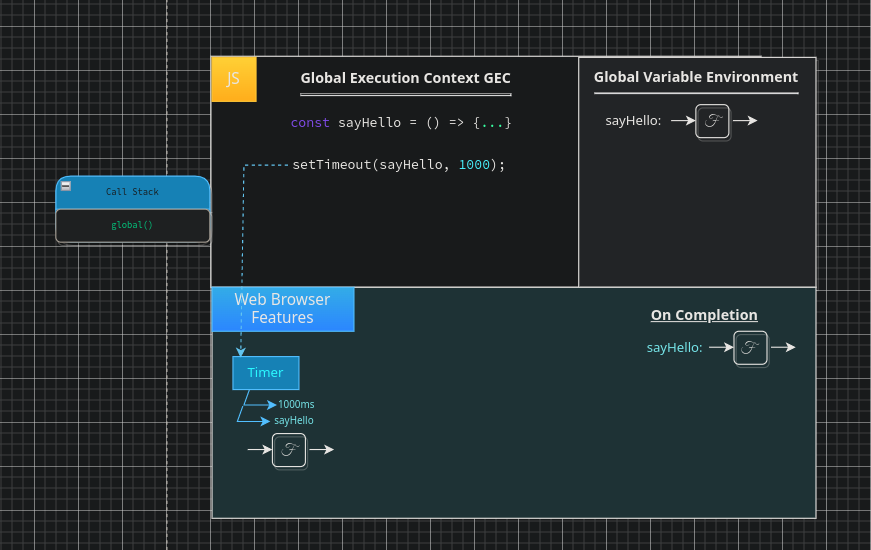
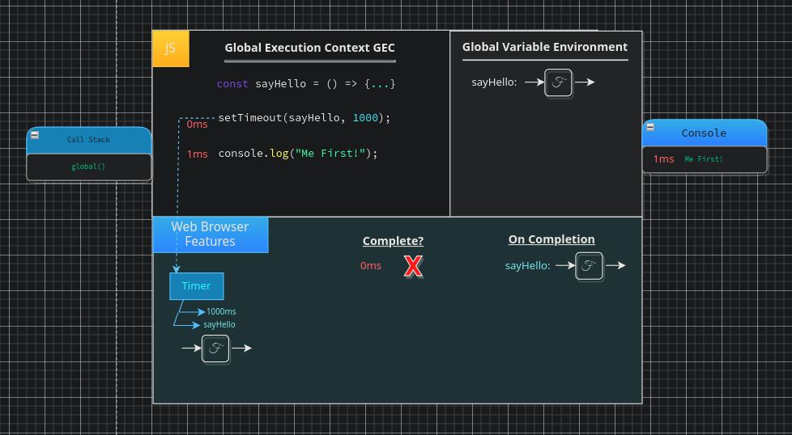
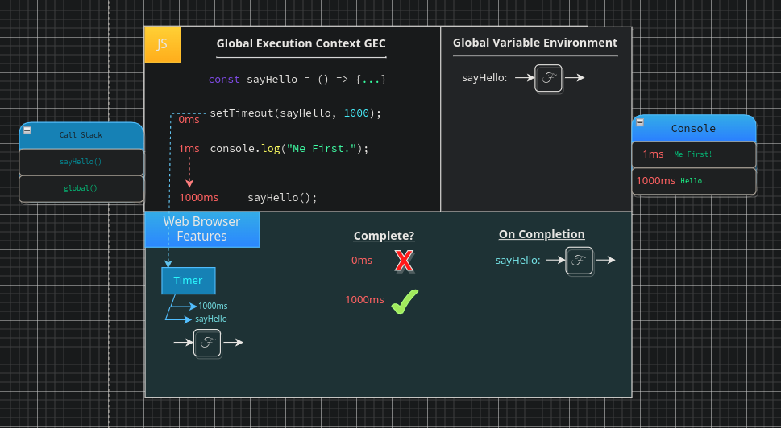

# Web Api Interface

As we discussed in the previous chapter JS has far more to it than just our JS code. The browser adds a lot of functionality to JS that would otherwise not be possible. Here we are going to explore the JS `engine` further, we will see how JS interacts with the browser, and how the MDN API performs. If you would like to look at the `Web API`s in more detail you can check out the information at [MDN](https://developer.mozilla.org/en-US/docs/Web/API).

<pre>
<code>
const sayHello = () => {
    console.log("Hello!");
}

setTimeout(sayHello, 1000);

console.log("Me First!");
</code>
</pre>

The above code snippet is nothing more than we have seen prior, however, there are a few new things to discuss. Notice how in this example we are using the `ES6` function syntax. It is important to note that, at this point, there is no difference between this and the syntax we have already been using, at least in the context of the above function. `ES6` is the more commonly used syntax, we will cover the differences in the execution as they appear later on, at this point you should simply familiarise yourself with the syntax and understand that it is doing exactly the same as the `function` keyword; assigning a `label` in memory to hold our `function` code, note that at this point we have only declared the `function`, we have yet to run it.

 

    

 

On the next line we see a call to the `setTimeout` function which we briefly discussed in the previous chapter. We know that in this case the `setTimeout` is actually a `label` which allows us to interact with our `Web Browser Features`, this is where things get a bit more interesting. This "`function` call" is not actually going to do anything in JS, rather, it is going to be read by the engine and execute code in some other language. As per the execution of this `label` a `timer` will be set up within our `web browser features` with the information we passed it in order to be setup. This includes our `duration` and the `function` we have passed. The timer set up in our `web browser feautres` is a `closure`, this means, it will also have a `onCompletion` function which will run when the function execution is deemed `complete`.

 

    

 

Thus, the question which follows; how do we know when our function is deemed `complete`? for this we need the concept of `time` (denoted in red on the diagram). We will use ordinal timings, this means that the time scale itself is not necessarily accurate, it is simply to show the order and timings in which processes occur in a format that is easily understandable by the human mind. In reality many of these processes will take `nanoseconds` if that.

We begin execution of `setTimeout` at approximately `0ms`, this is the moment at which our function call triggers the functionality within the browser. At this moment we have a check for completion, since we passed a duration of `1000ms` we only complete when our `time` equates to `1000ms`. At `0ms` this has not completed, however, our `facade` function has actually done it's work. Lets explain, the only job of the `facade` function was to set up our `timer` which it has done successfully. This means it is now free to forward in the code, hence, after `1ms` of time passing we run our `console.log` to log the line `Me First` to the console. At this point all of our regular JS code is done,completed, we have ended the execution of our JS script, but do note that our `timer` is yet to `complete` and thus we have not yet ran our `sayHello` function.

 

    

 

This is an important distinction thus we will repeat it again in different terms. We have finished executing our `JavaScript` code, but our process that we set up within the `browser` has yet to complete. This process continues ticking over in the background within our `browser`, at `1000ms` our `timer` completes triggering our `onComplete` function adding it to the `call stack` and logging `hello` to the `console`.

 

    

 

Notice how the web browser is effectively directly affecting the `stack` at a later point in time. what happens if we are running a function on the `call stack` at the point the callback returns to JS execution? what if we had a `timer` of `0ms` rather than `1000ms`? what if we have a massive list of functions running in the `call stack`? when would this `callback` be allowed to execute? these are all questions which must be raised in order to define the rules for interacting with this whole other context of the `browser`. First we must clarify, when we show the `sayHello` function in our `browser` it is not the JS function being copied. Much like how we showed in previous examples that our functions were saved between the `GVE` and `local memory` this is a representation, a reference to our function in memory, a pointer to the location of where the original implementation is saved in memory where the `backpack` of any surrounding data associated to our function will also be located as a part of the function definition.

In order to make our code predictable so that we may work with these browser features with the confidence that our code will behave as we expect, we must have very strict rules for working with these external features outside of JS. 
