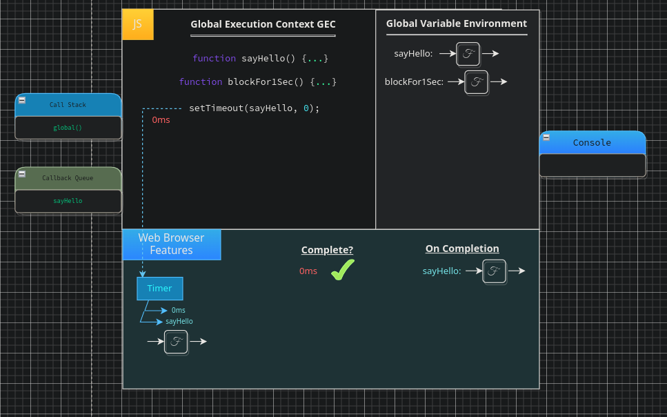
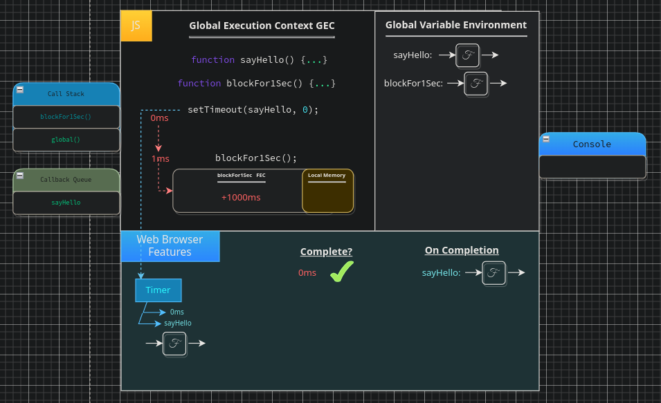
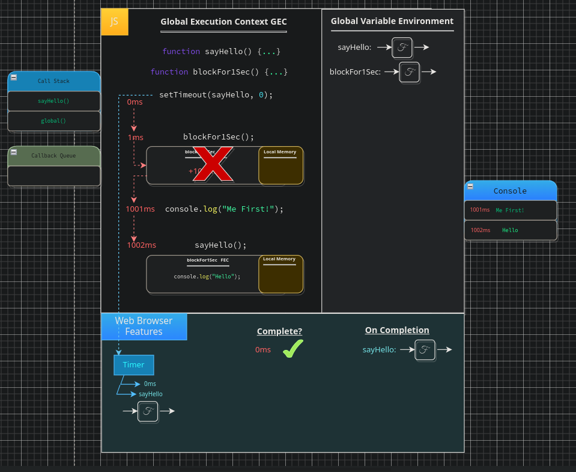
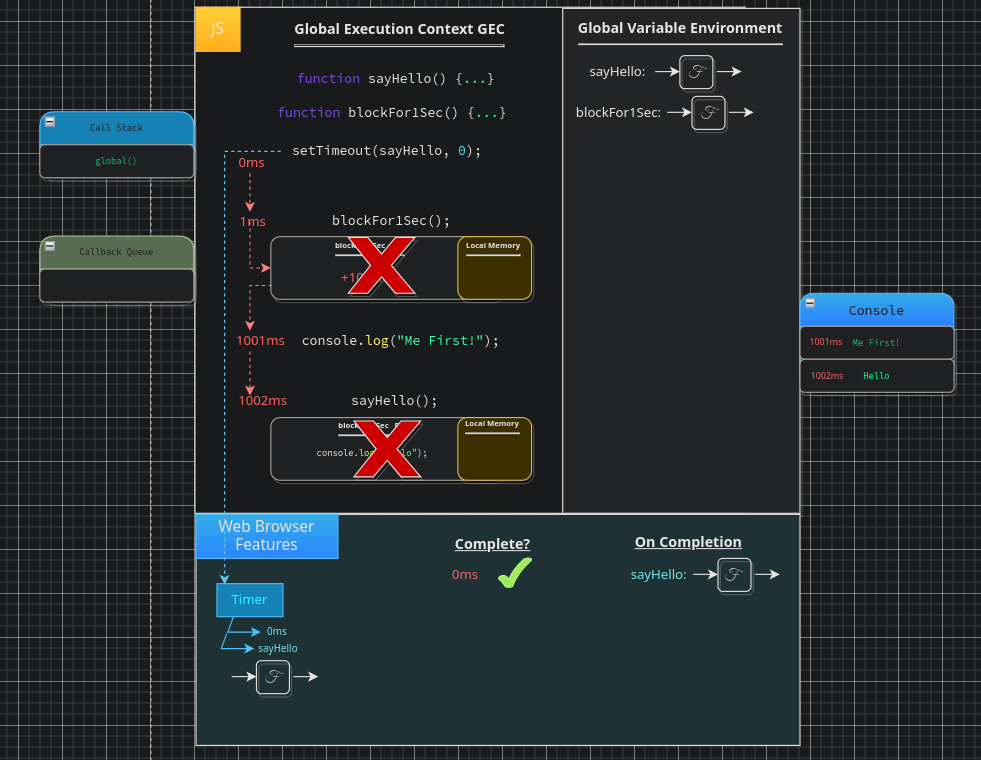

# Web Api Interface

As we discussed in the previous chapter JS has far more to it than just our JS code. The browser adds a lot of functionality to JS that would otherwise not be possible. Here we are going to explore the JS `engine` further, we will see how JS interacts with the browser, and how the MDN API performs. If you would like to look at the `Web API`s in more detail you can check out the information at [MDN](https://developer.mozilla.org/en-US/docs/Web/API).

 

<pre>
<code>
const sayHello = () => {
    console.log("Hello!");
}

setTimeout(sayHello, 1000);

console.log("Me First!");
</code>
</pre>

 

The above code snippet is nothing more than we have seen prior, however, there are a few new things to discuss. Notice how in this example we are using the `ES6` function syntax. It is important to note that, at this point, there is no difference between this and the syntax we have already been using, at least in the context of the above function. `ES6` is the more commonly used syntax, we will cover the differences in the execution as they appear later on, at this point you should simply familiarise yourself with the syntax and understand that it is doing exactly the same as the `function` keyword; assigning a `label` in memory to hold our `function` code, note that at this point we have only declared the `function`, we have yet to run it.

 

    

 

On the next line we see a call to the `setTimeout` function which we briefly discussed in the previous chapter. We know that in this case the `setTimeout` is actually a `label` which allows us to interact with our `Web Browser Features`, this is where things get a bit more interesting. This "`function` call" is not actually going to do anything in JS, rather, it is going to be read by the engine and execute code in some other language. As per the execution of this `label` a `timer` will be set up within our `web browser features` with the information we passed it in order to be setup. This includes our `duration` and the `function` we have passed. The timer set up in our `web browser feautres` is a `closure`, this means, it will also have a `onCompletion` function which will run when the function execution is deemed `complete`.

 

    

 

Thus, the question which follows; how do we know when our function is deemed `complete`? for this we need the concept of `time` (denoted in red on the diagram). We will use ordinal timings, this means that the time scale itself is not necessarily accurate, it is simply to show the order and timings in which processes occur in a format that is easily understandable by the human mind. In reality many of these processes will take `nanoseconds` if that.

We begin execution of `setTimeout` at approximately `0ms`, this is the moment at which our function call triggers the functionality within the browser. At this moment we have a check for completion, since we passed a duration of `1000ms` we only complete when our `time` equates to `1000ms`. At `0ms` this has not completed, however, our `facade` function has actually done it's work. Lets explain, the only job of the `facade` function was to set up our `timer` which it has done successfully. This means it is now free to forward in the code, hence, after `1ms` of time passing we run our `console.log` to log the line `Me First` to the console. At this point all of our regular JS code is done,completed, we have ended the execution of our JS script, but do note that our `timer` is yet to `complete` and thus we have not yet ran our `sayHello` function.

 

    

 

This is an important distinction thus we will repeat it again in different terms. We have finished executing our `JavaScript` code, but our process that we set up within the `browser` has yet to complete. This process continues ticking over in the background within our `browser`, at `1000ms` our `timer` completes triggering our `onComplete` function adding it to the `call stack` and logging `hello` to the `console`.

 

    

 

Notice how the web browser is effectively directly affecting the `stack` at a later point in time. what happens if we are running a function on the `call stack` at the point the callback returns to JS execution? what if we had a `timer` of `0ms` rather than `1000ms`? what if we have a massive list of functions running in the `call stack`? when would this `callback` be allowed to execute? these are all questions which must be raised in order to define the rules for interacting with this whole other context of the `browser`. First we must clarify, when we show the `sayHello` function in our `browser` it is not the JS function being copied. Much like how we showed in previous examples that our functions were saved between the `GVE` and `local memory` this is a representation, a reference to our function in memory, a pointer to the location of where the original implementation is saved in memory where the `backpack` of any surrounding data associated to our function will also be located as a part of the function definition.

In order to make our code predictable so that we may work with these browser features with the confidence that our code will behave as we expect, we must have very strict rules for working with these external features outside of JS.

## Event Loop and Callback Queue

To answer the previous questions we are going to take a look at another example. In this example we are going to purposefully block our thread of execution from completing. In JS we cannot run one long process, thus, we must run many smaller processes in order to block the thread of execution. We can check the timing of our function by using `performance`, this is a `browser` feature which provides access to performance related information. This can be incredibly useful for optimisation of algorithms, timing your functions, and attaining access to various metrics. In our analysis code we will omit the details of our `blockThread` function for clarity, this function could be any kind of high cost process, but if you want a concrete example of how we might simulate a blocking process here is a quick example.

 

<pre>
function blockThread () {
    let x = 999992;
    while (--x) { }
}

const startTime = performance.now();

blockThread();

const endTime = performance.now();

console.log(
    `Execution of blockThread took ${endTime - startTime} milliseconds`
);
</pre>

 

Just know that when we use blockThread in our code, we will not necessarily be referring to this exact code as we have already said, it could be ANY blocking process which blocks for `x` amount of time. The code we will be analysing will simply utilise the `setTimeout` to set a callback to run at `0ms`, we will then block the thread and log the string `Me First` right after, this will demonstrate one of the fundamental rules which our `callbacks` must follow known as the `order of execution`.

 

<pre>
function sayHello () { console.log('Hello'); }
function blockFor1Sec() {...}

setTimeout(sayHello, 0);

blockFor1Sec();

console.log("Me first!");
</pre>

 

We begin by defining the `sayHello` function, setting the code to the label `sayHello` in the `Global Variable Environment`. We then also define a function `blockFor1Sec`. Our first line of interest is our `setTimeout` function, we know that this function will trigger in the `web browser` the switching on of a `timer`, passing it the `duration`. Our timer is set up at approximately `0ms`, with a duration set of `0ms`, and an `onCompletion` pointing to a reference of our `sayHello` code in memory, this function will run once our `timer` is marked as `complete`. Our first check runs on our `timer`, at `0ms` is our `timer` complete? yes, it is, so it is time to add our `sayHello` function to our `call stack` correct? not quite! the thing is we are still missing a fundamental part of our JS knowledge. In the JS event loop we also have the `callback queue`, Since this function is a `callback` it joins this particular queue to be run once all other execution has completed. Thus, here is the first of our very strict rules that apply when we interact with our `browser` features. Whenever we add an item to the `callback queue` it must sit there and wait until the `callback queue`, the `Event Loop` will continuously check the main stack to see if it has any frames to execute, once there are no more frames to execute in the main stack it will then check our `callback queue` if the `callback queue` has items to execute it pops the message from the `callback queue` into the main `call stack` for execution. Only at this point, when all other code in our `thread of execution` has completed that the items in our `callback queue` will be processed. Any kind of `asynchronous` process in JS will be added to the `callback queue`, this is important to note as mixing `synchronous` and `asynchronous` code can lead to unintended consequences and be difficult to trace.

 

    

 

Thus, at `1ms` of time passing we call the function `blockFor1Sec`, as such a new `Function Execution Context` is created and our thread of execution weaves into this context. Whilst we may not know the details of what process happens within this `FEC` we do know that the process will sit inside this `FEC` for `1000ms` blocking our `thread of execution`, this would likely be a process using a for loop with many iterations, at no moment here are the items on the `callback queue` allowed to pop onto the main `call stack` and so, although we set our `timer` duration to `0ms`, we find that we are still waiting long after the time at which the execution was set to run at.

 

    

 

And so we return to the `Global Execution Context` at `1001ms`, at which point `blockFor1ms` is `popped` from the `call stack` and our `FEC` is destroyed but what happens to our `sayHello`? sadly, our `sayHello` function is still stuck in our `callback queue` at this point as we still have our `console.log()` to run. At `1001ms` the string "`Me First!`" is logged to the console.

Finally, at `1002ms` the event loop will check our `main stack`, see that there are no items left to execute, and therefore move on to check the `closure queue`, at this point `sayHello` is popped from the `callback queue` onto the `call stack` finally outputting our `Hello` string to the `console`.

 

    

 

And so, to complete our mental model, we end our execution having logged "`Hello`" to our `console`, `sayHello` is popped from the `call stack` and the `FEC` is destroyed and as is such our execution is complete.

 

    

 

To review, what we have learned. We are looking for a rule, by which JS must abide when it interacts with `asynchronous` code. This rule comes in to parts, in order for our `callback` to be run:

1. The `call stack` must contain no executable items.
2. The `global execution context` must be completed.
3. All `synchronous` code and regular execution must have completed.

To answer our earlier question, what would happen if we had a large number of logs? the item on the `callback queue` would simply wait. What if we had an infinite `while loop`? again, the item on the `callback queue` would wait, forever if it must. In such a case the function would never even be `popped` from the `callback queue` nevermind pushed to the `call stack`. This allows us to be absolutely certain at what point our items stored within our `callback queue` will be run, enabling us to predict our codes behaviour, I may not know the exact moment at which this will run, but I do know the order of which each function will run. How does JS do this? between each line of code there is a check on the `call stack` you can think of this as an if check:

 

<pre>
<code>
// Pseudo code for demonstrating the idea only

if (callStackIEmpty && gecExecutionIsComplete) {
    let callBack = callbackQueue.pop();
    callStack.push(callBack);
} else {
    continueExecution();
}
</code>
</pre>

 

This check is performed on every line of code, prior to running the code, should there be anything on the `call stack` the item atop of the `call stack` will be popped off and executed, if there is no item on the `call stack` but there are items left to run within the `GEC` the execution of the `GEC` will continue. Once all of this is complete the `callback queue` will be checked, if there are any items on the `callback queue` the item at the end of the `queue` will be popped from the `callback queue` and pushed onto the `call stack`, these will be completed in order, however, not necessarily consecutively. This IS the JS `Event Loop`, its entire job is to check this `queue` very quickly between each lines execution. This is one of the most important aspects of `JavaScript` to understand when dealing with `asynchronous` code. In face, up until `ES6` this was the entire model of `asynchronous` JS, however, `ES6` added some additional features which we will discuss in detail in the upcoming chapters.

 

---

[<< prev](./10_synchronicity.md) | [next >>](./)

