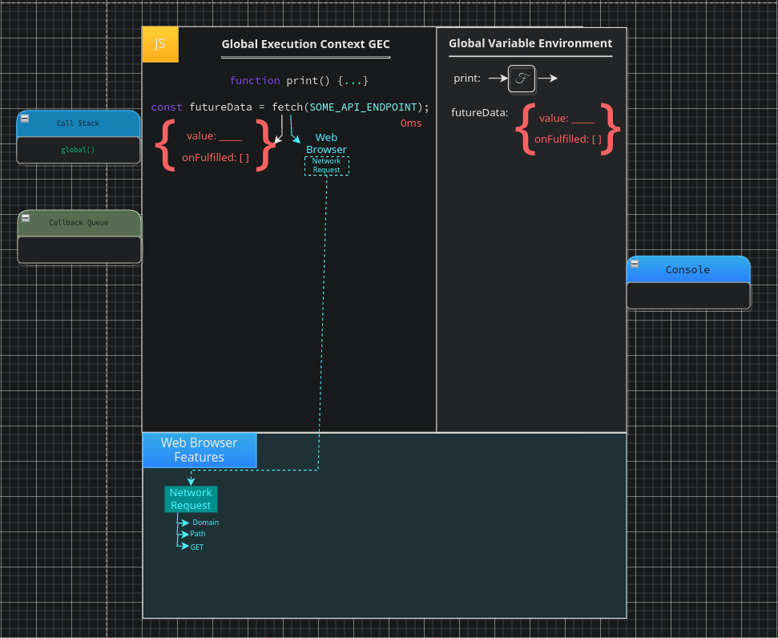
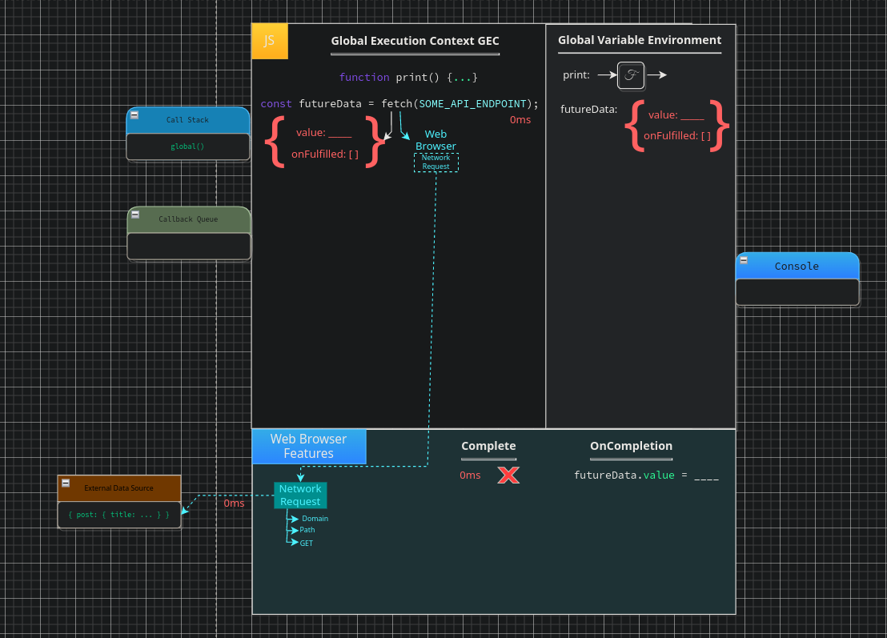
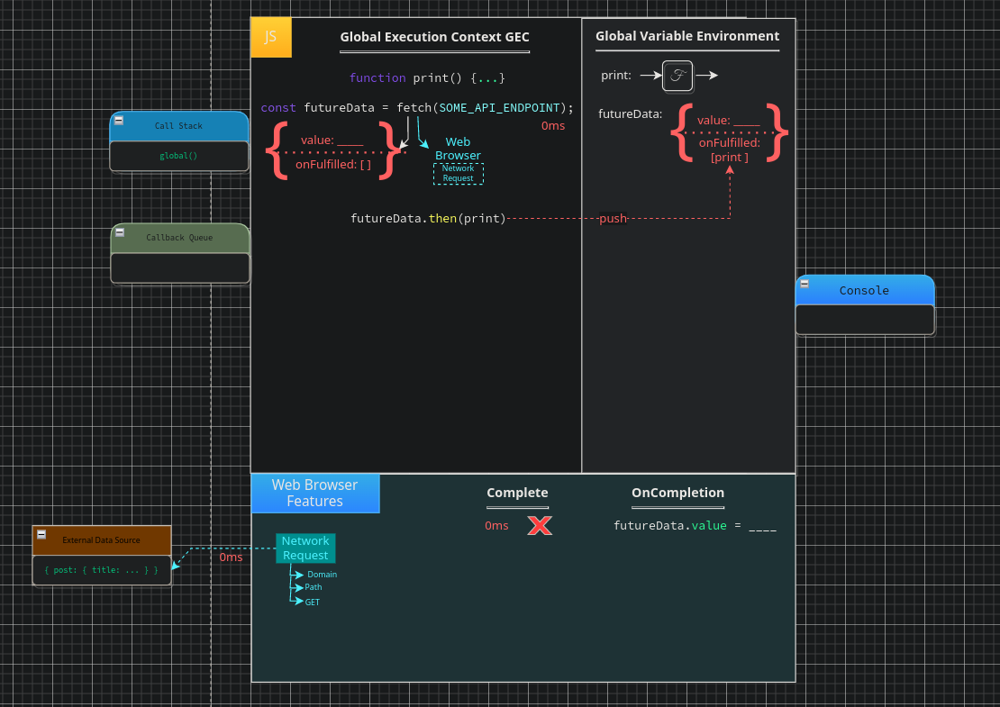

# Promises

`ES2015` (aka ES6) introduced new features for handling `asynchronous` code in JS. We have already covered some async feautres but `Promises`  offer a somewhat better alternative to `callbacks`. They enable two pronged `facade` functions which do two things:

1. They set up our background web browser work much like `callbacks`
2. They immediately return a `placeholder` object

Returning to `callbacks` for a moment. Recall when we used our `facade` to set up a `timer` we didn't attain any means of tracking the our code in the `browser`. True we can log out the value when we begin setup and when the function is eventually called but between the initial and end states there was simply no means of knowing the status of our `callback`. Hence we are left in the dark, merely waiting and hoping that at some point our `function` will be pushed onto the `call stack` and complete execution. We may defined a `callback` as a function which is called within another function. In the case of our previous examples the `browser` handles taking our function and attaching the parentheses later in order to `push` the function unto our `call stack`.  Similiarly, `promises` are used much in the same manner as `callbacks` yet reduce the complexity of the code by removing the necessity for nested `callbacks`. Rather than our data being injected into our function arguments, as happens in callbacks leaving it stuck within the execution context of the current running function, `promises` instead make use of an alternative approach to the handling of `asynchronous` tasks.

`Promises` not only improve upon `callbacks`, providing a more manageable means of working with `asynchronous` code, they also actively improve the means by which we are able to handle errors. We acquire a multitude of benefits when choosing `promises` including:

1. Readability - Promises are far more readable than callbacks
2. Handling - Asynchronous operations and error handling improved
3. Flow Control - How asynchronous logic flows through the cod
4. Error Handling - More elegant error handling

`Promises` are named in such a manner that they are explicit as to their own function without the need to understand the implementation at all. What do we mean by this? what do you think a `promise` is? what is a `promise` in any given context? you might say; "<em>it is an indication from another person of something yet to come</em>", or perphaps "<em>a declaration, assuring that something will occur in the future</em>". Personally I think that the best way we may define a promise would be the following statement:

 

<BlockQuote style="margin: auto; width: 500px;">
<em>
"A vow or oath that one will attempt to fulfill some obligation in the future."
</BlockQuote>

 

As with any `promise` We don't necessarily need to act upon it right away, but we know that at some point the `promise` will either be fulfilled, fail to come to fruition, or in a wrost case be completely broken. In fact, in the case of JS, our promises have four potential states:

1. Fulfilled - The Action related to the promise succeeded
2. Rejected - The Action related to the promise failed
3. Pending - The Promise is still pending - it is neither Fulfilled nor Rejected
4. Settled - The Promise has been either Fulfilled or Rejected

When declaring `promises` we must therefore do so using a special `Promise Constructor`. The `promise constructor` takes a single argument, which is itself a `callback` function. This `callback` function takes two arguments; `resolve` and `reject`, we use these by performing operations within our `callback`, if everything in the `callback` succeeds we then call `resolve` otherwise we call `reject`. `Promises` can then be `consumed` by the consumer functions: `then` and `catch`. `then()` is invoked when a promise is either `resolved` or `rejected` whilst `catch()` will be triggered when we reach an `error` state or again if our `promise` is `rejected`.

Once again this raises yet another question. If our `rejected` promise triggers both `then` and `catch` in what order will they execute? the answer is simple, `promises` are governed by rules of `precendence` which dictate that the `then` function will always be ran first, followed by `catch` should the `promise` resolve successfully and a result is received. Alternatively, `catch` will always run first followed by `then` if the `promise` is `rejected` or an `error` is received. So what is different about these functions? well... nothing really, having them both is mostly for readability `catch` is actually just shorthand for: `.then(null, errorHandler))`.

 

<pre>
const promise = new Promise((res, rej) => {
    const x = 1;
    const y = 1;

    if (x === y) {
        res();
    } else {
        rej();
    }
});

promise
    .then(() => console.log('Success!'))
    .catch(() => console.log('Uh-oh! Error!'));
</pre>

 

So do `promises` function in pure JS? no, they are using another of our `browser features`. When create a `promise` in JS within our `browser features` a network request is created under the hood, but rather than simply doing this and leaving JS with no means of monitoring our request status until later a `promise` will have a consequence in JS immediately. The point at which our `fetch` label triggers our `network request` within the `browser` JS will simultaneously receive a special `promise` object. What is so "special" about this type of object? the relation it has to the `network response` in the browser. Our `promise` object will begin with an empty `value` argument which will be updated by our `browser` features at a laterpoint. This object will sit in our `GVE`, when our background processes complete the data returned will, as previously stated, fill in the blank space in our object.

## Promises in Action

It's all well and good defining `promises` but to really understand them you need to see them in action. Lets run through an example as we have with `callbacks`. This will be somewhat more complex than previous examples due to the sheer amount that occurs with `promises` under the hood. This small five letter word (`fetch`) is going to be responsible for the concurrent management of our `promise` object in JS and the configuration of our `network` communication in the browser.

<pre>
function print(data) {
    console.log(data);
}

const futureData = fetch(SOME_API_ENDPOINT);
futureData.then(print);

console.log('Me First!');
</pre>

We begin with our first line where we declare a function `print`. This creates a `label` in the `GVE` in which the entirety of our `code` is stored, just as we have seen a number of times before. We then declare a constant of the label `futureData`. This is, as usual, uninitialized at first, however, we know that the value of this constant will be the `evaluation` of the function call (or `facade` call in this case). To the right we see a call to our `fetch` facade function, and we know that this will set up our `network request` in the browser, we also know this must have a consequence immediately in JS.

### JS Consequence

The first consequence we will discuss is the one that happens within JS itself. At this moment in our code we receive our special `promise` object, this is just a normal `Object` like any other JS object created automatically in JS by `fetch`. This `Object` however comes bundled with two `properties`:

1. Value - The value of our `response object`
2. OnFulfilled - The `functions` to run when our `value` updates

Value at this point is undefined as it has yet to have any value set to it. `OnFulfilled` is actually a hidden property which holds the value of an empty array, eventually this array will contain our `callbacks`. This whole `Object` is stored in the `futureData` label in the `GVE` to which it is assigned. Now, when we head off to the `web browser features` to set up our `network request` we have an `Object` kept in memory giving us a strong link between the process that occurs in JS and those which occur within the `browser`.

### Web Browser Consequence

Our second consequence occurs within the `web browser`. This has much greater consequences than our JS consequence due to the fact that our `fetch` facade handles a lot of configuration that, in other languages, we would have to do ourselves. So lets begin, first we set up our `network request`, usually an `XHR` request (`XML HTTP Request`). Here we will keep this as generic as possible and refer to it here as simply a `network request`. Upon creating our `promise` the `browser` sets up our `network request` which requires the knowledge of the `address`, in turn consisting of a `domain` (the address of the computer we are communicating with) and `path` (the path to the `endpoint` we are calling). These arguments are passed to our `network request` from the  arguments we supplied to the `fetch` facade. `Fetch` will also send a third argument, in the form of our `HTTP` method, the `HTTP verb`, defining our action (if you have not heard of this before it would be worth looking at `HTTP Verbs`, `APIs` and `REST` when you get the time). `Fetch` defaults to a `GET` request, if we wanted to send a `POST` request we could supply a secondary argument to `fetch` in the form of an `options` object to specify information about our intended request, in this case we simply let it default.

 

    

 

This is already a consideravle amoubt of work considering the small amount of code we have thus far, yet, even now our `web browser` still hasn't done yet. Consider what else occurred within our `browser` when we were using `callbacks`, we have set up our `network request` yes, but we have not yet checked for the `completion` of our `callback`.  Unlike when we used the `timer` there is no finite time at which our `callback` will be pushed to the `callback queue`, instead, we are reliant on the `x` amount of time it may or may not take to retrieve data from the endpoint we provided. As such, our `network request` will first begin its work. It will send a request to our data source, when our browser performs it's first complete check at `0ms` it will however be incomplete as, although we have sent the request, we are still waiting on a response from our source.

 

    

 

When using `callbacks` we passed a function to run when our `onComplete` completes. However, we don't have any `function` passed into `fetch` here, so how do we know what to do on completion anyway? this is where our special `promsie` object makes its return. On completion, when our response data is received, our `response object` value will instead be passed back into JS within the empty `value` property of our `promise` object. This raises a new problem, we don't know when this data will be returned, we have no inclination as to when it will be received, but when it is we need JS to automatically run some code to use the request and perform whatever task we might want to conduct with it. This is where the `onFulfilled` property comes in. The `onFulfilled` property is an array, and there is a very good reason for this, this proeprty will store all the functions that we want to have automatically run when the `value` property is updated, which also happens to be when our `fetch` task completes; hopefully returning the data back from our source successfully. As such, we need a way of placing our `print` function within this array. This would mean that when our data is received the `show` function would automatically be run when `value` is updated with our response data. We do so by utilising our consumer function `then`. As previously discussed, `then()` pushes the provided arguments to our `onFulfilled` array, note that we cannot update this array directly as `onFulfilled` is a hidden property.

As such we move to our next line where we actually call `then()`. As such, we call it on our special promise object `futureData` which is currently saved in our `GVE` under this label. We pass to it our entire function definition of `print` which `then()` then pushes this unto our `onFulfilled` array.

 

    

 

Take a moment to appreciate that all of this setup came from simply 2 lines of code, most of it done by a single five letter label (`fetch`). In the background we have all of our setup completed, we are awaiting a response, talking to an external source, we have a callback waiting to run; and we have our special `Object` which gives us a connection from our `browser` back to JS. Remember, when our response data comes in through our `network response` the `value` of our object will update triggering all `callbacks` within our hidden `onFullfilled` property. Also recall that `fetch` that we have been using is merely a `label` for interacting with our `network response` feature in the `browser`, as with all these features this is actually running in another language which supports the ability to communicate accross a network as JS does not. This means we can now move on with executing our code, consider that as we do on each line our `Event Loop` will check our `complete` status.

And so, we move on, and thus at `1ms` of execution time we log the string "`Me First!`" to our console.

---

[<< prev](./11_web_api_interface.md) | [next >>](./)

