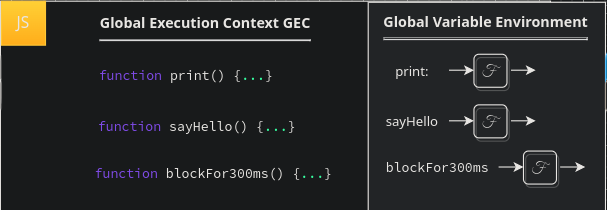

# Continuing Promises

In the previous chapter we explored the `rules` or precedence along with the `rules` governing at which point our `callback` functions are run, along with "how" our functions are mapped, when they trigger, and how our request data is passed back to JS from our browser. We covered a lot, and you'd be forgiven for thinking we had finished with `promises`, yet there is so much more to learn in regards to promises. First we must realise we are missing a key component of our execution, when does our deferred function in the fulfillment array, given that it is automatically invoked, end up on the `call stack` exactly? To explore this we are going to look at a more complex piece of code, here we will see the order of which our deferred functionality returns to JS to be pushed to our `call stack` and executed.

<pre>
function print(data) { console.log(data); }
function sayHello() { console.log('Hello!'); }
function blockFor300ms() { ... }

setTimeout(sayHello, 0);

const futureData = fetch(SOME_API_ENDPOINT);
futureData.then(print);

blockFor300ms();

console.log('Me First!');
</pre>

Let us first consolidate what we already know. On initial analysis we instantly know that in our `GVE` 3 functions are about to be declared, one with the label `print`, another with the label `sayHello`, and another with the label `blockFor300ms`.  We also know that when we use our `setTimeout` facade we will be utilising a `browser feature` in which a timer will be set up with the duration of `0ms` and a `callback` prepared referencing our `sayHello` function code.

We then know that our `fetch` facade will also instantiate another `browser feature` which will set up a `network request`, we wont know exactly when this will complete as it is determined by when the data is returned, but we do know that until it is, after each line, the JS engine will check our `onComplete` in the same manner as the `timer`. We also know that at the same time our `promise` object will be created in JS with our `value` and `onFulfilled` fields, initially blank and empty. When we call `then` we add our `print` function to the `onFulfilled` array, and this will be run when our `value` is updated in the `object`. Finally we call know that `Me First` will be logged, presumably first, not simply because of the string itself, instead we can deduce this from the fact we know that our `timer` will be deferred, although it is `0ms` experience tells us that this will be added to the `callback queue` which will not be popped until all other code is executed. we can also assume that this will be similar for our `fetch` facade as it is not only also a `browser feature`, it is a `blocking` call which would other wise hang our application whilst we await data, from the previous example we know that this does not occur, therefore it must be deferred to allow JS to continue execution.

So how about we parse through this and determine whether or not our predictions are correct? remember `computing` is a `science`, although many don't see development that way it really is, this means you should always be looking to implement the scientific method where you can. This means beginning with a problem, analysing said problem, determining a hypothesis, testing the hypothesis, observing the effects, condensing the hypothesis into a coherent theory, and then testing said theory once again with observational data. A mistake many junior devs make is either not starting at the beginning of a problem, being unwilling to take a step back, or blindly trying things without any methodology, this increases the time it may take to solve a problem and decreases your chances of ever even solving it, let alone understanding where it went wrong in the first place. Be methodical, be a scientist.

## Exploring Call Precedence

We begin with our declaration of `print`, `sayHello`, and `blockFor300ms`. As we have already established many times this will create a reference in memory assigning our entire code of each function to their corresponding label:

 

    

 

We then get to our more interesting line of code, the facade, `setTimeout`. We reach our `facade` which our JS `engine` parses, in this case the `V8` engine, as such, it finds runs the `label` which has the associated `C++` code in `V8` which handles our timer setup. From this we can infer that the `timer` browser feature will be set up with the argument `sayHello` as a function to add to our `callback queue` on completion along with the duration as to how much time should pass before our function is added to the `callback queue`, in this case `0ms`. Our `engine` the runs our first completion check at `0ms`. From our provided duration the engine can see that the allocated amount of time has passed, thus our `sayHello` function is added to our `callback queue` and thus we are able to move onto our next line of execution.

  

    

At `1ms` of execution time we create a `fetchData` label in the `GEV`, assigning it the evaluated value of `fetch`. `fetch` is a facade for functionality written in `C++` in the `V8` engine much like our timer, except in this circumstance we are going to interface with the `network response` feature. The first consequence of this occurs within JS itself, a special `promise` Object is created and stored via the `futureData` label within the `GVE`. The properties on this object will be a label `value` with the value uninitialized and a hidden property of an empty array assigned to the label `onFulfilled`. Our `network request` is sent off at this `1ms` mark right away, but we wont hear a response back for a while, therefore on our first `complete` check the engine finds that we have not yet received our data, therefore our task has not yet `completed`.

 

    

 

Thus, once again, we are free to move unto our next line of JS code. Take a moment to consider how many times our code would have been blocked thus far if we were unable to complete these tasks asynchronously. On our next line we call our `then` consumer function pushing our `print` function unto the hidden property array `onFulfilled` with our `arguments` being filled in automatically on invocation by the value stored in `value`.

 

    

 

At `2ms` of execution time we run the function `blockFor300ms` adding it to the `call stack` and creating a new `function execution context`. Our `thread of execution` weaves into the context and is blocked by some process for `300ms`. Concurrently, for arguments sake lets say at around `270ms`, our browser has received a response from our external data source updating our `value` within the `promise` object with our `request object` data and automatically triggering our `onFulfilled` function invocation. This is the point at which we are missing a key component, you would be forgiven for thinking that this task would be assigned to the `callback queue` just like our `timer`, however, in this case our task is instead assigned to something known as the `microtask queue`. We know our `event loop` checks between every line of code if there are any tasks on the `call stack`, if there are it will run them, if not it will instead check the `callback queue`. Prior to this there is the `microtask queue` which will be checked before the `callback queue`, if there are any tasks, it will de-queue the task and push it to the `call stack`. We will define this in greater detail shortly, for now, just know that our `print` function has been added to this queue.

Thus our code continues, exiting our `blockFor300ms FEC` at `302ms` running our next line of code which logs the string `Me First!` to our console. Since all of our synchronous code has run, thus our `event loop` has no more tasks to run on the `call stack`. Our `event loop` next checks the `microtask queue` where our `print` task currently exists and thus pushed `print` onto the `call stack` removing it from the `microtask queue`. So at roughly `303ms` our data received from our `response object` is logged to the console via the `print` function.

 

    

