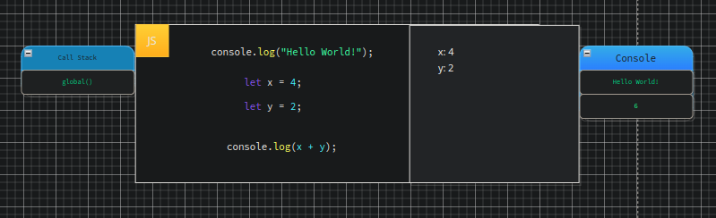
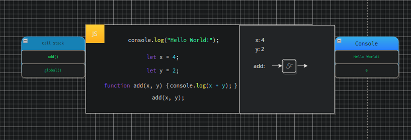
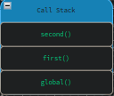
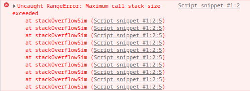
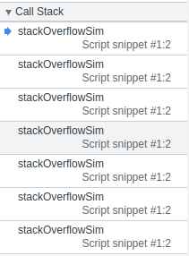

# Event Loop

In the previous chapters we focused extensively on `promises`. Due to the sheer amount
handled under the hood when dealing with `promises` we traversed a lot of ground over
the course of the previous two chapters and introduced a few new concepts which we
have not yet had chance to really delve into. In this chapter we will cover these
concepts in more detail starting with what the `event loop` is, how it functions
and then down to each of the individual queues which exist in JS. This will be
essential for when we delve back into `Node`.

So, what is the `event loop`? we have seen it in action already, essentially the `event loop` is the secret behind JS `asynchronous` code. Whilst JS is a `blocking` single-threaded language the `event loop` allows it to masquerade as a multi-threaded language via a few data structures and clever tricks. Let us first take a look at a quick visualisation of the JS `event loops` as provided by [Mozilla](https://developer.mozilla.org/en-US/docs/Web/JavaScript/EventLoop) themselves.

 

    

 

This is a very simplified visual mode, as we can see we have three concepts, the `stack`, the `heap`, and the `queue`. Objects are allocated in the `heap` which denotes a large unstructured region of memory. The queue specifically refers to our `message queue` which lists messages to be processed. Each message has a function associated which is called to handle message data. At some point during the `event loops` the runtime begins handling messages from the `queue` and its corresponding function is called. This creates a new `stack frame` for the functions use.

If we apply this to our previous examples we can see that the `event loops` is constructed of our `call stack`, our `queues`, and our `heap` memory. Lets take a look at an example beginning with `synchronous` JS.

## Synchronous Event Loop

JS is a blocking single-threaded language. As such we can imagine this as a restaurant with a single waiter. Now, this may not be a problem if there are few guests, or if the tasks are spaced out. In this case the waiter has no issue serving the guests in the order at which they raise their hands. However, if the restaurant becomes busy and another guest raises their hand whilst the waiter is still serving another he cannot serve them both at once. instead he must make a note to got to that customer next after he completes the current task. This analogy is similar to a simple JS application, every task we tell JS to conduct must be performed in order. These tasks are added to the `event queue` which is how JS keeps track of all of the tasks which are requested. As we receive events they are added to the `queue`, should the thread be busy with a particular task the other tasks will remain on the queue until the `thread` has completed the current task and pops the next one into the `call stack`. You can imagine the `event loop` simply as a `while` loop which runs whilst the `event queue` is not empty. This is our main thread of execution, our global context. As we learned previously no `asynchronous` code will run until all `synchronous` code in this context completes. If the process currently being executed happens to call another process the `thread` has no choice but to follow these calls in the order that they are called until the execution completes even if other tasks require resources.

## Asynchronous Event Loop

Much like our prior example of the `synchronous` event loop our `asynchronous` example works in exactly the same way. The difference here is when we come across an `asynchronous` task such as a `callback` or a `promise` which utilises our browser features. In this case our browser setup will configure whatever may need to be configured, for `promises` we receive our special `promise` object, for a `timer` we simply get a `timer` added to the `callback queue`. After each line of code the `event loop` will check our queues. This includes the `callback` and `microtask` queue, note that our items will not be added to the `callback` until they have completed (for instance the `timer` will await a duration and a `promise` will await the response). If the `event loop` finds an item in our `callback queue` it will be popped from the `callback` or `microtask` queue respectively. Once all `synchronous` code has completed the `event loop` will pop these tasks from our `queues` pushing them unto the `call stack`.

Now that we have a basic level of understanding of the concept of the `event loop` we will take a look at the individual concepts starting with the `call stack`.

## Call Stack

When execution of a JS application begins the `JVE` sets up a global execution context. This is instantly pushed unto the `call stack` and will remain as such until all code is completed. When we are running in our global execution context this is the code which is being run. If I write everything in the `GVE` then this will remain on the `call stack` until the entirety of the script ceases execution.

 

 

If we have another function call within our global context we defer to a function execution context. This `FEC` also gets pushed to the `call stack`, this is how JS keeps track of our execution order, along with function `scope` (note that in these examples we have omitted the execution contexts, we know how these work at this point, this is simply to illustrate the `call stack` itself). Once execution of our function completes the function will be popped from the `call stack`. This includes the `global execution context`, once all of our code has completed wihtin the `GEC` the `GEC` itself will be popped from the `call stack`. Note that the `call stack` itself immediately executes whatever is passed to it.

 

 

## Web APIs

We know that the `call stack` will execute everything we pass to it immediately, but what if we want to instead delay our execution? well, we can't do this in the `call stack` directly, but as we have explored in previous chapters we can utilise features provided by the `browser` to set up a `timer`. When we need access to these external features we need to utilise `Web APIs`, we covered a few of these including the network response, console, DOM, timer, and local storage. Recall that these features are not a part of JS but part of the external browser. We utilise them via `facade` calls which the `engine` maps to a corresponding function in the engine itself, in `V8` this would be a `C++` function. We have to access these via their object name unless they are assigned to the global scope e.g. `window.localStorage` is assigned to our global variable, hence we can access `localStorage` without the use of `window`.

## Overview

This is a lot of information, but the `event loop` itself is actually very simple. If we ignore the additional features provided to JS we can simplify the `event loop`. It is simply a runtime model, responsible for collecting and processing events, and executing queued sub-tasks, that's it. We have three main concepts: `stack`, `heap`, and `queue`.

### Call Stack

 

<pre>
function second(x) {
    let y = 20;
    return (x + y) + 10;
}

function first(x) {
    let y = 10;
    return second(x, y);
}

const result = first(10, 2);
</pre>

 

If we take a look at the above code we know that when we reach our `result` declaration the evaluation of `first` will begin. This will add our function call to the `call stack` opening a new `execution context`. This also creates a new `stack frame` which itself holds references to all of the local variables within the function. Within the `first` function a call to the `second` function occurs, pushing this unto the stack above `first`, this creates another `stack frame` and another `execution context` within the current `execution context`. Once the `second` function ceases execution the evaluation of our `return` statement is returned to the `first` functions `execution context`, this is then popped from the `stack`. The same then occurs with the second function to the `GEC`. We have seen all of this in action prior, the new thing to focus on here is the `stack frames`, this is how JS keeps track of our current execution context.

 

    

 

#### Stack Overflow

A rather common occurrence when using recursion in any language is the `stack overflow` error. Even if you have never seen
this before you have likely heard of it due to the website `Stack Overflow` giving it some fame. `Stack Overflow` occurs
when we fill our `call stack` but do not have any means of removing anything from it. This happens when we have nested
calls which recur over and over without ever resolving any of the internal contexts. As we know, when we execute a function
we create a new execution context, this adds a new frame unto our `call stack`. The `Call Stack` however is finite, and therefore
can be filled. Should we exceed our `call stack` we receive the following error.

 

 

We can set a breakpoint within a function causing a `stack overflow` error and trace through the `call stack`. We don't need to trace through all the way (that could take a while) but we can clearly see even after just 5 runs that something is very wrong.

 

 

The code used to trigger this looks like this:

 

<pre>
function stackOverflowSim() {
    try {
        stackOverflowSim();
    } catch(error) {
        console.error(error);
    }
}

stackOverflowSim();
</pre>

 

Lets quickly walk through what happens here. The first line we declare a function `stackOverflowSim`, a reference to our code is saved in the global variable environment. On the next line our function is invoked creating a new function execution context and adding our function to the `call stack`. On the first line our function in this execution context our function is invoked again, creating another function execution context and adding it to the call stack. This occurs over and over an infinite number of times. Notice how none of our calls ever have a chance to return, they never cease execution, and thus never leave the `call stack`. This means that our `call stack` is filled, the pointer exceeds our stack bound, and an error is thrown. Note that our stack size is browser specific.

We can easily avoid a stack overflow by making sure our context always has a path to resolution. This enables our function to complete execution in the `call stack` which enables all of the others to also complete.

 

<pre>
function recursion(count) {
    try {
        count += count;
        if (count > 999999999999999999999) {
            console.log(count);
            return;
        }
        recursion(count);
    } catch(err) {
        console.error(err);
    }
};

recursion(1);
</pre>

 

### Heap Memory

The `heap` is a large, mostly unstructured, region in memory where `Objects` are stored. This is an incredibly simple concept which ties in with the `stack`. When we create an Object within an executing `stack frame` the reference to the Object is stored on the `stack frame` whilst the actual Object itself is stored within the `heap`.

    

 

Lets say we have some code. Everytime we declare a variable, Object, or function its value is stored in the `memory heap` with a reference to the location of the value being placed in the variable. Whenever the code needs the value/function it uses this memory location reference to look it up. JS will clear this up automatically via `garbage collection` by determining which nodes are no longer necessary. It does this by checking each reference in memory, it uses a technique called `mark and sweep` which is an algorithm that determines the objects which are safe for deletion based on which objects are reachable in memory and those which are not, the logic here being that the nodes which are now unreachable are no longer in use and therefore can be reallocated to free up memory for another process. As such, the garabage collector begins with the `global` object. It moves from one object to another in memory identifying the objects which are referenced by other objects, any unreferenced objects are reclaimed.

### Memory Leaks

It is possible that the way we write our code may make some pieces of
the heap unreclaimable although the program no longer has use for them. This is what we call a `memory leak`. `Memory Leaks` are parts of memory which were necessary, and used, in the past but are no longer needed yet the memory has not been reclaimed and returned to the pool for some reason. Although JS handles much of our memory management we still need to be cautious with memory. It is possible that the way in which we code may cause our application to run out of all available memory due to our heap memory not being reclaimed correctly. There are key mistakes we may make which can increase the possibility of `memory leaks`:

1. Global Variables - Stay around throughout the execution of the program, even if they are not needed, if these variables are deeply nested objects a lot of memory may be wasted.

2. Not Removing Event Listeners - When an Event Listener is no longer needed it should be removed. For instance, if we create many Event Listeners for a particular page or location the user no longer needs these Event Listeners, however, these listeners will still be there taking up memory. Note that if you declare an event listener with an anonymous function rather than declaring a function first you cannot remove th event listener later should you need to. We can remove event listeners from an element via the `removeEventListener` method.

3. Uncleared Time intervals - `SetInterval` would be an instance of this. `SetInterval` allows us to execute some code recurrently based upon a set amount of time. This means our `callback` is invoked every how ever many milliseconds we pass as our second argument. This becomes a problem if we reference a number of objects within our `callback`. If this setInterval is never cleared the references will still be valid thus the program can never free any of our memory in the heap even if they are no longer used. A better approach to using `intervals` is to use the `ID` which is returned from the `setInterval` function that way we can clear it using `clearInterval` once the work is done.

4. Removed DOM Elements - If we programmatically remove DOM elements within our code, but the elements are still referenced, the memory is not freed in our `heap`.

### Queue

Finally, we have the queue, specifically the `message queue`. This is simply a `FIFO` construct which keeps track of messages to be processed. Each message has an associated function of which to execute, when we say we process the message we mean we have popped it from the `queue` and invoked the function associated with it. When the function associated with the `message` is executed it is pushed unto the `call stack` in the same manner as any other function. Queues run to completion, this means that the queue is executed sequentially, there can be no interruption, no pausing, no parallel execution of multiple messages, each function once called must run to completion.

### Event Loop

The `Event Loop` can be thought of as a `while loop` which awaits for a message and processes that message when received. If there are multiple messages in the queue it pops the eldest message and executes the function pushing it unto the `stack`. Messages are added to the queue whenever an event which has an `event listener` attached occurs.

 

<pre>
while (queue.waitForMessage()) {
    queue.processNextMessage();
}
</pre>

 

---

[<< prev](./13_promise_order.md) | [next >>](./)

