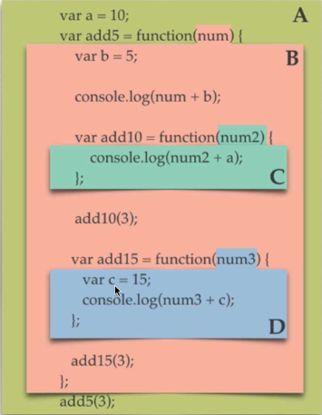

# Execution Contexts

In previous chapters we have discussed the concept of `execution contexts` in great detail, however, we still have not developed a complete picture of how contexts actually work. What is an execution context in relation to our `event loop` for instance? well, this is a rather simple question to answer, an `execution context` is simply an amalgamation of the concepts we previously discussed (the `heap` and the `call stack`). It is created by the JS engine utilising both these concepts, you can think of it as a `wrapper` which contains the information for managing the code that is executed.

When we launch our program we have access to our `global` objects. This is because a `global execution context` has already been set up for us at this point. We can prove this by accessing the global object, in the browser this would be the `Window` object, in `node` this would be the `Global` object. We also have the keyword `this` already bound to our `global` object, this is our environment which we run in the moment we start our application, the engine configures this `context` for us prior to us writing any code at all.

There are multiple phases the JS engine goes through when setting up our contexts. We have seen these in action but not particularly alluded to them as a concept thus far. These phases are:

1. Creation Phase
    - The Global Object Is Created (Window/Global)
    - `this` Is Created and Bound to the Global Object
    - Set Up memory Heap + Store Variables and Function Declarations

2. Execution Phase
    - Executes Code Line By Line (Call Stack)
    - Assigns Values to variables
    - Invokes Functions

 

<pre>
Note: That since ES2020 we have access to globalThis which allows us a consistent method of access to the Global Object across implementations of the JS engine.
</pre>

 

In the first of our phases (The Creation Phase) the JS engine first sets up the initial `Global Context`, it then `binds` the keyword `this` to this `global` object. Finally our `variable` values and `function declarations` are stored within the `memory heap`, we know this is mostly unordered memory, but think back to when we walked through our `Function` examples. The JS engine runs through on a first-pass reading our variables and functions into memory in this phase, but it has not yet executed them. This is essentially setting up our references, nothing will be evaluated in this phase. It is important to understand here that the JS engine is not creating these objects in memory whilst it executes, it is instead passing through twice, creating references in memory, and only after te creation phase has completed does it begin the execution phase. I must once again stress that these are `references` we are not `assigning` any of our values in this phase.

Thus our second phase begins, in the `Execution Phase` our code is read line-by-line `values` are assigned to our `label references` which are set up in the heap, this is where the right hand side of our assignments will also be `evaluated`, and `functions invoked` should we come across any, if this is a `function declaration` it is already stored in memory at this point so the JS engine simply locates it in memory and begins running our saved code. Think about the following code:

 

<pre>
<code>
console.log(x);

var x = 1;
</code>
</pre>

 

What is the value of our `log`? for those who have been around JS you likely answered `undefined`, and you would be correct, but why does this happen? well, as explained a moment ago, on our first pass JS simply runs through the `Creation Phase`, this creates our references in the `memory heap`, but no values are yet assigned. This means that when we have a variable declared we have a reference to it in memory, but we do not yet have a value, once we get to the execution phase `console.log` is run on the `call stack` before we have a value assigned and thus the value is the value `undefined`. Now compare this to how a function behaves:

 

<pre>
<code>
myFunc();

function myFunc {
    console.log('Hello world!');
}
</code>
</pre>

 

You will notice that the function runs as normal. when we have a function declaration we are able to invoke it prior to it's definition, be warned this can lead to sloppy code which is why many developers recommend using `function expressions` instead. This is possible because our function code is actually already saved in memory from our `creation phase`.

Notice how we use `var`, this is very bad practice as we should never use `global` variables. We do this in this example as if we were to use `const` or `let`, as is best practice, we receive an error. This is what we would expect to happen in other languages, it occurs because `let` and `const` differ in scope from `var`. In JS `var` and `function` declarations are subject to `hoisting`. `Hoisting` is often incorrectly described as the movement of declarations to the top of the code. JS is not moving our declarations, nor rearrangement of code. Instead, during the `creation phase` our code is scanned, all `var` and `function` declarations are then added to our `heap memory`. This means that they can be used prior to declaration as they already exist in memory, though the assigned value may be `undefined` if a `var` has not been initialised, this will also throw no error which can make code very difficult to debug.

Note, the reason using `function expressions` is recommended is because it forces us to use good code structure. Function expressions are not subject to `hoisting` thus, if we try this example with a function expression our code will simply fail. This forces us to always declare our functions prior to them being used, it also enforces the idea that variables should be declared at the top of our functions, and that every function is a value.

 

    

 

From experience we know that there is more than just the `global` execution context as we have discussed here. We know that every function invocation will add to our `call stack` creating a new `function execution context`. These sub-contexts act in the same manner, but as new contexts. This means that our memory is local to the functions context, but the same phases and setup occur within this context just like running within our global context. The difference we see is the value of `this` within our function execution contexts. The value of `this` is dependent on how the function is invoked. Its value is set to the object of which the execution context belongs.

## Scope & Scope Chain

We have talked a lot about execution contexts, whilst it may seem unrelated, `scope` is a fundamental concept in any programming language, but particularly so in JS when it comes to execution contexts. You see, whenever we add a `function` to our `call stack` (when it is `invoked`) we create a new `execution context` as we have seen many times. That is not all however, we also create a whole new variable environment within our context, which defines our `scope`. A `scope` can be though of as a set of rules which determine the set of all accessible referenced objects (variables and functions). The official definition of `scope` in JS reads as such:

<pre>
"<em>Scope refers to the visibility of variables or functions to the executing code. In JavaScript a variable or function is visible to the executing code, if it is in the current lexical environment or the parent lexical environment.</em>"
</pre>

We can break this down into a more simplistic definition, the basic concepts of which can be taken as:

1. Scope is determined lexically - Variable and Function definitions determine if they are accessible from the code dependent on the location of the code itself. We know that the JS engine will first read through our code in the creation phase line-by-line and create references in our `heap memory` for every `function` and `var` keyword discovered. We also know that nothing is evaluated in this phase, `functions` will not be invoked until the evaluation phase, at which point `functions` will create a new execution context upon invocation. By lexically we mean that the scope is determined line-by-line or "in order", this definition means that we have access to references from within our current `variable environment` or that of it's parent, for instance, if we have a function definition inside a function we have access to the variables in the parent function, this is called a `closure` and we have seen this in prior chapters.

2. JavasScript uses function scope - A `function` creates an execution context, the `variable environment` created within this `execution context` helps determine our scope.

3. A unavailable referenced item in the local scope will lead the JS engine to traverse the `scope chain` seeking it - This is to do with our first definition. We know that if a referenced item is not available in the current scope it may be available in the `parent` scope. We also know that we do indeed have access to references in our parent scopes. This is where the scope chain comes in. If the JS engine is unable to find the `reference` within the `local scope` the engine will traverse through the `scope chain` back through each parent until it finds it. If it does not find it it goes up to the next parent and so on... until it either finds the reference, reaches the `global scope`, or returns an error, if the script is not in strict mode the engine may create a new variable and assign the value to it.

 

    

 

Thus far we have seen `function` and `global` scope but since the release of `ES6` JavaScript also includes `block` scope which is handled by the keywords `let` and `const`. With the above code what happens if we change every `var` declaration to `let`? well, although our code is handled differently we would find that our code still functions the same as using `var` in terms of scoping here, so what is block scoping? block scoping is determined by our curly braces, the reason we see no difference with the above code whether we use `let` or `var` is that our blocks in this code are all themselves functions. In order to see block scoping we need a different example:

 

<code>
const sum = function(x) {
    let y = 20;
    if (y > x) {
        let z = 10;
    };
    console.log({ xy: x + y });
    console.log({ xz: x + z });
};

sum(30);
</code>

 

Here you will see that z is not accessible fro outside of our block. It is declared within the curly braces of our if statement. The declaration of the `sum` function however still becomes a member of the `global` scope even though we use `const`, thus the outer scope will still function in the same manner. We can even declare a function of the same name within a block scope, this is because the block scoping will mean that a new reference is created in memory, hence, these two declarations would actually point to two completely different variables of the same name but in differing scopes. Just to illustrate that the curly braces are the only thing that matters in terms of creating a block scope try making a prediction before running the following code:

 

<pre>
<code>

let greeting = 'Hello!';

{
    let greeting = 'Aloha!';
}

console.log(greeting);

</code>
</pre>

 

If you predicted `Hello` would be the outcome you would be correct. We create a block scope using curly braces, thus the second let in our code is an entirely different function, try putting a log in within the block to log the second greeting, then try removing the second greeting but still logging it within the block. You should see that JS has access to the parent scope too, and that the scope chain will find our first greeting declaration in the event that it has no declaration within the current block scope. However, the block scope variable is not accessible from outside of that block scope as demonstrated above. Although we often associate the curly braces with different types of statements, it is the braces themselves in the grammar which create our scope. 

---

[<< prev](./14_event_loop.md) | [next >>](./)

