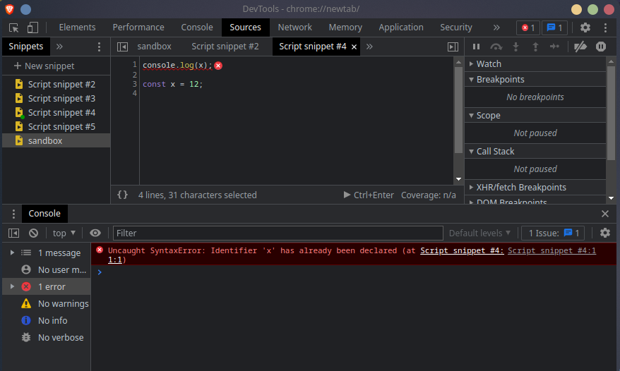

# Execution Contexts

In previous chapters we have discussed the concept of `execution contexts` in great detail, however, we still have not developed a complete picture of how contexts actually work. What is an execution context in relation to our `event loop` for instance? well, this is a rather simple question to answer, an `execution context` is simply an amalgamation of the concepts we previously discussed (the `heap` and the `call stack`). It is created by the JS engine utilising both these concepts, you can think of it as a `wrapper` which contains the information for managing the code that is executed.

When we launch our program we have access to our `global` objects. This is because a `global execution context` has already been set up for us at this point. We can prove this by accessing the global object, in the browser this would be the `Window` object, in `node` this would be the `Global` object. We also have the keyword `this` already bound to our `global` object, this is our environment which we run in the moment we start our application, the engine configures this `context` for us prior to us writing any code at all.

There are multiple phases the JS engine goes through when setting up our contexts. We have seen these in action but not particularly alluded to them as a concept thus far. These phases are:

1. Creation Phase
    - The Global Object Is Created (Window/Global)
    - `this` Is Created and Bound to the Global Object
    - Set Up memory Heap + Store Variables and Function Declarations

2. Execution Phase
    - Executes Code Line By Line (Call Stack)
    - Assigns Values to variables
    - Invokes Functions

 

<pre>
Note: That since ES2020 we have access to globalThis which allows us a consistent method of access to the Global Object across implementations of the JS engine.
</pre>

 

In the first of our phases (The Creation Phase) the JS engine first sets up the initial `Global Context`, it then `binds` the keyword `this` to this `global` object. Finally our `variable` values and `function declarations` are stored within the `memory heap`, we know this is mostly unordered memory, but think back to when we walked through our `Function` examples. The JS engine runs through on a first-pass reading our variables and functions into memory in this phase, but it has not yet executed them. This is essentially setting up our references, nothing will be evaluated in this phase. It is important to understand here that the JS engine is not creating these objects in memory whilst it executes, it is instead passing through twice, creating references in memory, and only after te creation phase has completed does it begin the execution phase. I must once again stress that these are `references` we are not `assigning` any of our values in this phase.

Thus our second phase begins, in the `Execution Phase` our code is read line-by-line `values` are assigned to our `label references` which are set up in the heap, this is where the right hand side of our assignments will also be `evaluated`, and `functions invoked` should we come across any, if this is a `function declaration` it is already stored in memory at this point so the JS engine simply locates it in memory and begins running our saved code. Think about the following code:

 

<pre>
<code>
console.log(x);

var x = 1;
</code>
</pre>

 

What is the value of our `log`? for those who have been around JS you likely answered `undefined`, and you would be correct, but why does this happen? well, as explained a moment ago, on our first pass JS simply runs through the `Creation Phase`, this creates our references in the `memory heap`, but no values are yet assigned. This means that when we have a variable declared we have a reference to it in memory, but we do not yet have a value, once we get to the execution phase `console.log` is run on the `call stack` before we have a value assigned and thus the value is the value `undefined`. Now compare this to how a function behaves:

 

<pre>
<code>
myFunc();

function myFunc {
    console.log('Hello world!');
}
</code>
</pre>

 

You will notice that the function runs as normal. when we have a function declaration we are able to invoke it prior to it's definition, be warned this can lead to sloppy code which is why many developers recommend using `function expressions` instead. This is possible because our function code is actually already saved in memory from our `creation phase`.

Notice how we use `var`, this is very bad practice as we should never use `global` variables. We do this in this example as if we were to use `const` or `let`, as is best practice, we receive an error. This is what we would expect to happen in other languages, it occurs because `let` and `const` differ in scope from `var`. In JS `var` and `function` declarations are subject to `hoisting`. `Hoisting` is often incorrectly described as the movement of declarations to the top of the code. JS is not moving our declarations, nor rearrangement of code. Instead, during the `creation phase` our code is scanned, all `var` and `function` declarations are then added to our `heap memory`. This means that they can be used prior to declaration as they already exist in memory, though the assigned value may be `undefined` if a `var` has not been initialised, this will also throw no error which can make code very difficult to debug.

Note, the reason using `function expressions` is recommended is because it forces us to use good code structure. Function expressions are not subject to `hoisting` thus, if we try this example with a function expression our code will simply fail. This forces us to always declare our functions prior to them being used, it also enforces the idea that variables should be declared at the top of our functions, and that every function is a value.

 

    

 

---

[<< prev](./14_event_loop.md) | [next >>](./)

