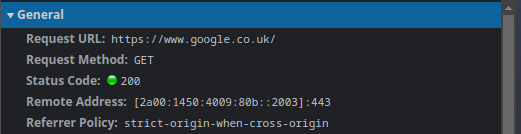
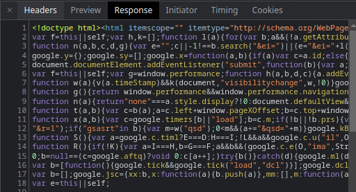
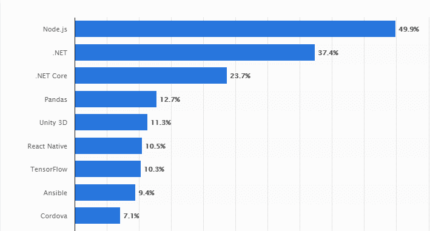

# Node

To solve a problem, one must first not only see the problem, but understand it at it's most fundamental level. This applies even to the tools we use, as a blacksmith must understand the difference between a hammer and a chisel, so must we understand our own tools in our metaphorical belt. Using a tool  to it's full effect requires a deep fundamental understanding, whilst we may get by for a while without this understanding, eventually, we will need to understand the causal effects our actions invoke. In this regard, `Node` is no different from any other tool.

## What is Node?

`Node` is a `JavaScript` runtime, running on the `V8` engine. It is an environment which contains everything we need to run `JavaScript` programs. This means we may now use `JavaScript` in the same manner as any other scripting language; whether it be conducting operations in a `terminal`, creating a `Command Line Interface` (CLI) application, or via the `Read Eval Print Loop` (REPL). We may perform Input/Output operations (I/O), spin up servers, serve content, perform `networking` tasks, and even `filesystem` operations.

 

 

In order to understand `Node` we must first be familiar with the `CLI`, as this is where we enter commands to interact with our `Kernel`, which in turn interacts with our `OS` and `hardware` devices (if you'd like to learn more about the `Kernel` click [here](https://github.com/Summoned-Skali/LinuxInDepth/blob/master/chapters/18_kernel.md)). For `Linux` this is `Bash`, `Mac` tis the `Terminal`, `Windows` - the `Command Prompt` and so forth...

The `CLI` is how much of computing was conducted prior to the first `graphical user interfaces` (GUIs) taking over. When working with `Node`, we may often be working with the `CLI`. If you lack familiarity with the `CLI` I would take a diversion here to learn at least the basics of using the `CLI` on your particular `Shell`. If you are unsure where to go from here; focus on `bash`, `bash` is the most common, and therefore the one you will most likely find in use no matter where you work, but also, in our wonderful modern world, it is a standard which has been applied to `MAC` (as it now has a `Linux`core), and `Windows` via `powershell` or the `windows subsystem for Linux` (WSL). Once you have a the basics down come back and we shall continue.

## Processors & Machine Code

To truly understand `Node` we need to define what it is at it's core; thus we shell delve from here on into the `V8 Engine`. Even so, in comprehending `V8` in all it's complexities, we will need to delve into even deeper than the `V8` source code, truly popping the hood on our system level interactions; looking at the very thing that is driving our whole system; the `Microprocessor`. We will begin with a quick overview, this is only for our own mental model, but in the following chapters, we will explore in greater detail the concepts at a `bytecode` level. If you want to delve deeper into the technicalities of `Microprocessors` on your own I recommend some great books in my [Learning Resources](https://github.com/Code-Of-The-Crescent/LearningResources) section.

At its most basic level you can think of our `Microprocessor` as a "tiny machine", or The organisational `brain` of our system. Much like a real brain it takes inputs, and outputs electrical `signals`, manipulates electrons passed through `switches` to represent on/off signals, ultimately resulting in the completion of some task. Everything we do is to give the `Microprocessor` instructions on completing the task, to understand our intent the `Microprocessor` itself "speaks" a language, this is not often the one which we write in the modern world but a language known as "Machine Code" optimised for machine use, not humans.

However, not all `Microprocessors` "speak" the same language. When we give the `processor` instructions to run a program, it must receive those instructions in it's particular language so that it may run said task. There are a variety of languages that `processors` may be designed to understand; `IA-32`, `x86-64`, `ARM`, `MIPS`, etc... the term `Machine Code` therefore encapsulates a set of programming languages understood by computer `processors`. Every program run on a computer is compiled down to `Machine Code` in order to run on the processor.

 

 

The exceptions to this are `interpreted` languages, which, rather than compiling down to machine code are read and interpreted by another program `(the interpreter`) which carries out the actions. Obviously, at some point this program follows the same process. Furthermore there are also a subset of languages which compile to `bytecode` such as `Java`, this `bytecode` is then run by a virtual machine which makes the translation from `bytecode` to machine code.

The main take away here being that, ultimately, when we are writing a program there is always some other process converting what we write into something the `processor` can understand and execute. Often, this is even multiple languages, so that the program may run on many differing `processors`. Whilst It is possible to write `Machine Code` directly, and some people do, modern devs don't tend write much of it. This is because machine code is notoriously difficult to write and understand at a glance. Take the example below:

 

 

Why is this? well, it is important to understand that we don't write code for the benefit `processors` at all. Yes, the processor must understand the instruction set at the end of the line, but primarily code is written for humans (other developers) to understand. Thus, there have been many advances over the years to make our programs more readable, simpler to write, and as a consequence, easier to debug. This is why programming languages are so much closer to natural language than `Machine Code`, if our only goal was to write code optimal for `processors`, and we  had no need for human understanding, we would simply write `binary` and cut out the processing needing to compile our code down at all (if you haven't already worked out, this would be a nightmare for a human to do with the size and complexity of modern programs especially).

So,what does each line of that machine code do you ask? it manipulates memory addresses, we wont go into detail here, but if you have an interest in delving into some machine code, you can checkout out my [Atari Repo](https://github.com/LukeMcCann/Atari_AssemblyProjects) which uses Assembly 6502/6507, this isn't quite machine code and is slightly easier to understand, but is a good starting point if you want to get into it. In modern codebases, you will notice that as time has moved forward, we have moved further away from the lower level, and it seems like we will continue to do so, with further and further abstractions resulting in higher level languages.

 

 

Abstraction is great, it helps us to concentrate on our particular application features, handles complex features such as low level memory management, garbage collection, and handling, yet we also pay a price for such convenience. Due to being so far removed from how our processor actually handles the requests it receives, we can develop an inaccurate mental model of how a tool such as `Node` is actually working, hindering our perception and ability to write efficient, and accurate, code.

So I posit to you the first important concept to grasp using `Node`; `Node` is written in `C++`, yes, you heard me, although we are writing code in `JavaScript` `Node` itself is a `C++` program, this is because `V8` (the engine that converts our `JavaScript` to `Machine Code`) is written in `C++`. When we interact with our `filesystem` and other peripherals, which `JavaScript` itself does not usually support, we are actually interfacing with `C++` on our machine to complete these tasks. This gives us additional functionality to our JS, of which to understand we must first delve deeper into the `V8` engine.

## The V8 Engine

This section is a little long, a little complex, but worthwhile understanding, once you grasp these concepts you will know more than much of the developers surrounding you about how `Node` actually works at the lower levels. Before we discuss the `V8` engine, we must briefly discuss the `EcmaScript` standard. If you have worked with `JavaScript` for any length of time it is likely you are familiar with `EcmaScript`. It is simply a standard of which many of the `JavaScript` engines are based (there are many many engines...). The `EcmaScript` standard tells us how the language should work and how it should be implemented. It exists to keep different implementations consistent with handling common tasks (you can check out the latest ecmascript draft [here](https://tc39.es/ecma262/)).

You will notice that the specification describes all that `JavaScript` is supposed to <em>have</em>, and also that which it is supposed to <em>do</em>. It describes, `JavaScripts` behaviour, and sets the  expectations for when certain things are done in the language, as such `V8` adheres to this specification.

So what does the `V8 Engine` do? `V8`, is a program (yes, the `V8 Engine` itself is a program) just like those we ourselves write. It converts `JavaScript` into instructions which a `processor` can understand. When you think about `V8` what do you see? what do you "think" the `V8` engine is? what does it look like? how does it do what it does? these questions are likely to still elude you at this point, you probably see the `V8` engine as a blackbox, one which, we feed something into and it does some "magic" (processing) and spits out some machine code which allows the processor to conduct our tasks. This is fine for beginners perspective, but, we want to understand the whole process, if we are interacting with our processor, we need to know exactly how what we are doing affects our system, we need to understand `causality`.

 

<BlockQuote style="margin: auto; width: 500px;">
<em>
“with every action theres an equal opposite reaction. With every problem, there’s a solution: just a matter of taking action.”
</em> - Albert Einstein
</BlockQuote>

 

In every walk of life, whether you're a physicist, engineer, or anything else, `causality` is always at play. Our actions have consequences, in the real world and the digital realm alike. We need to be able to understand and trace these consequences in order to determine how our actions will perform. With the `V8` engine, we are in luck. We don't need any high powered lasers like those used to measure particles, or a geiger counter, such as the ones used for measuring radiation given off by expiring half lives. No, in our industry we are very lucky, especially with `V8` as google provides it as open-source, meaning, `V8` is free to; use, access, and transform as we see fit. We can access the `V8 Engine` source code [here](https://github.com/v8/v8) or via `git clone https://github.com/v8/v8.git`, from this point you can simply open your text editor of choice and view the files like any other project. Take a look at some of the files, demystify the blackbox, understand that this is just `code` like any other program, we can learn to understand it, though there is a lot to look through.

A key feature of `V8` involves expanding `JavaScript` through the implementation of additional features. `V8` itself can run standalone, or embedded into any `C++` application, as such, if you are writing a `C++` program, you have the ability to embed `V8` inside of your program and use it.

This also implies that if you are writing a `C++` program, you could even use it to translate other developers `JavaScript` code. Building on this, much like `React`, `V8` provides available hooks that we can use in our `JavaScript` code. When we write `JavaScript` code in `Node` it is passed to the `V8` engine (`C++`), this is compiled to `Machine Code`, we can also embed `V8` into our own `C++` program so that `JavaScript` code still gets run through `V8` to generate the `Machine Code`, but, since we are writing in `C++` we may also use hooks to add features to `JavaScript`. `V8` is fundamentally `C++` code that is taking `JavaScript` and compiling it. As such, `V8` allows us to write our own `C++` code which we can make available to `JavaScript`. We can make it so that if a developer writes a particular string in `JavaScript`, and passes it through our program, our `C++` code will be run. From this we can extend `JavaScript`s features, adding our own features to the language as needed. This is incredibly powerful, `JavaScript` was not designed for low-level operations, it is therefore fundamentally limited, due to the fact it was designed to be run in a browser. `C++` however, is a lower-level language, with many more features. We can do a lot with it, including, interacting with our hardware and OS. Essentially, anything we can do in `C++` we can make available to `JavaScript`. You can see this if you try running the `load` function in `JavaScript`, it should throw an error. `Load` is not a keyword in `JavaScript` it is not defined, but run it in the `Node REPL` and you will find it loads in the file you provide as an argument. This is because the `load` keyword is bound to a function in the `V8 C++` code, this means we can use it in our JavaScript code so long as the `Node` environment is running.

 

V8 Compile             |  V8 Embedded
:-------------------------:|:-------------------------:
  |  

 

### Client Server Model

Whilst the focus of this document is on `Node` we must touch on the `Client Server Model`. As previously intimated, `Node` is a backend technology, but what does this mean? A common pattern we often follow in web development is what we call the `Client Server model`. In this model we have two concepts; `client` and `server`. The `server` is the heavy lifter, accepting requests from our `client`, performing requested tasks, and responding to the `client`(s). Inversely, the `client` sends our `requests`, these `requests` ask for `services`, of which the `server` provides. The `client` may itself also do some work, however, much of the work is conducted on the `server`.

 

 

Traditionally, we would have a `client` machine send a request to a `server` which would then do some work and respond with the "answer", however, in the modern era it is important to make a distinction. Both of these concepts are just `programs`, often they are separate machines, for instance, my computer is a `client` when I browse to a particular web address, (e.g. the dns `google.co.uk` or ip `192.168.1.254`), a `request` is sent to the `server`, and a response, in this case a webpage returned. We can see this in action within our `devtools` via the `network` tab.

 

Client Request             |  Server Response
:-------------------------:|:-------------------------:
  |  

 

This is the standard communication model for communication on the `web`. The standard `client` would be the browser,
the standard server, our `web server` and a standard protocol for communication, usually `HTTP/HTTPS`. This is as far
as we will go into the `server/client` communication model, just know that this is a very basic model, we of course
also have `APIs` and various other forms of communication such as `websockets`, but this basic understanding will be
sufficient for starting with `node`, we will get into these other concepts at as we approach them naturally. Note that if you have written any `JavaScirpt` as a frontend developer, you have already worked with the `V8` engine, things like `DOM Manipulation` are outside of the `EcmaScript` standard, this is because our browser (such as `chrome`) is a `C++` program with an embedded `V8` engine, this means it can extend the functionality of `JavaScript` which has become a standard for the web. You can see the features which are available to `JavaScript` from the browser at [MDN](https://developer.mozilla.org/en-US/docs/Web/API/Window).<pre>

</pre> We have callable `APIs` within the `browser` which allow us to interface with additional features (check out some of the MDN API features for details).

 

 

### JavaScript Server Requirements

In previous years, when writing backend code, we were often forced to jump to another language. In my first role I spent my days writing a `PHP` backend, but a `JavaScript` frontend. This is still a highly popular method, as of the 7th October 2022 the usage rates for popular languages are as such:

| Language | Usage |
| --- | --- |
| Python | 1.3% of Servers |
| Node.js | 1.9% of Servers |
| Ruby | 6% of Servers |
| PHP | 78% of Servers |

 

Yes, we can see `Node` growing in popularity, around `50%` of companies use `Node` in some form, but the long established languages such as `PHP` are still heavily used. This is because of their popularity running on severs such as `Apache` and `Nginx`, these methods are battle tested across greater periods, and many legacy systems will likely remain using these technologies for years to come (those with trepidation towards `PHP` likely wont want to hear this). It became somewhat cool to hate on `PHP`, many of the negative aspects you hear have actually been improved since, much of `PHP`'s negative connotation comes from those who worked with `PHP` in its infancy, `PHP4` and even `PHP5` were not overly pleasant to work with, nor did they have many of the quality of life features the newer releases possess. Right now, enough about `PHP`, we want to talk about `Node`.

Don't be disheartened by the previous paragraph; though it isn't yet as widely used, `Node` is on an upward trend. `Node` is still somewhat in it's infancy, but is being rapidly adopted by newer start up companies due to the speed at which it allows us to develop backends with smaller teams. It is not a holy grail, nothing ever is, and it does have it's issues, remember, we should always choose the best tool for the particular job, one piece of advice I would give, don't learn syntax, you can google syntax, learn concepts. In ensuring you understand a concept you should find yourself able to implement it in any language, using any tool, even if it means somewhat translating it at first, just remember, all `languages` have the same basic building blocks to work with.

 

 

So the question is, what did these languages have that `JavaScript` didn't? What features are needed for a `server-side` language to be viable? how do we extend `JavaScript` so that it can manage a `server`? For one, we need better ways of organising our code into reusable pieces. If you have ever written a frontend using vanilla JS, you will have seen  how messy the code can get. We include various `scripts`, we end up with a lot of code in a lot of places, unless you follow the `component` pattern which was actually possible even prior to `react`, ([example here](https://github.com/Blue-Eyes-FrontEnd-Dragon/Star-Rating-Component/blob/master/js/rater.js)). We also need a method of dealing with `files` and `databases`; we almost always need a `database` with almost any level of complexity. We need the ability to communicate over `sockets`, a means of dealing with work that lasts a long time, and finally, the ability to communicate using standard communication protocols for accepting requests and sending responses. `Node` solves these problems by adding this functionality to `JavaScript` for us. In the next section we are going to talk, in detail, about exactly <em>how</em> `Node` does this.

___

[<< prev](./1_introduction.md) | [next >>](./3_nodecore.md)
