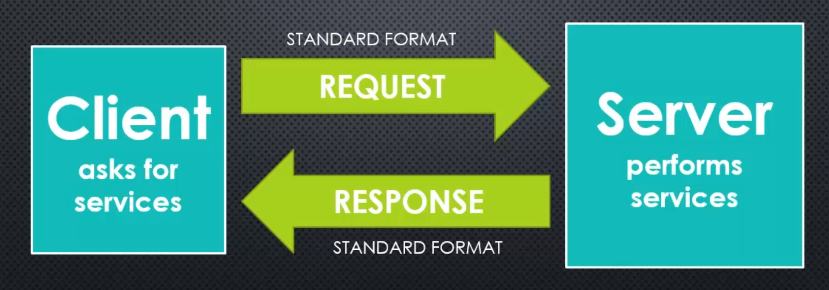

# Node

To solve a problem, we must first see the problem, we must first understand it at it's most fundamental level. The same goes for the tools we use, to use a tool effectively we need to understand our tools, `Node` is no exception.

`Node` is a `JavaScript` runtime, running on the `V8` enigne. It is an environment which contains everything we need to run `JavaScript` programs, this means we can now use `JavaScript` like any other scripting language, to do operations in a `terminal`, as a `Command Line Interface` (CLI), application, via the `Read Eval Print Loop` (REPL), we can do Input/Output operations (I/O), spin up servers, serve content, perform `networking` tasks, and even `filesystem` operations.

 

 

In order to understand `Node` we must first be familiar with the `CLI`. The `CLI` is where we enter commands to interact with our `Kernel`, which in turn interacts with our `OS` and `hardware` devices (if you'd like to learn more about the `Kernel` click [here](https://github.com/Summoned-Skali/LinuxInDepth/blob/master/chapters/18_kernel.md)). In `Linux` this is `Bash`, Mac it is our `Terminal`, Windows the `Command Prompt` and so forth...

The `CLI` is how much of computing was done prior to `graphical user interfaces` (GUIs) taking over. When working with `Node` however, we may often be working with the `CLI`. If you are unfamiliar with the `CLI` I would take a diversion here to learn at least the basics of using the `CLI` on your particular `Shell`. If you are unsure where to go from here; focus on `bash`, `bash` is the most common you will find no matter where you work, but also, in our wonderful modern world, it is a standard which has been applied to MAC (as it now has a `Linux`core), and Windows via `powershell` or the `windows subsystem for Linux` (WSL). Once you have a the basics down come back and we shall continue.

## Processors & Machine Code

In order to understand `Node` we need an understanding of what it is at it's core; thus the `V8 Engine`. To understand `V8` we need to delve into even lower level than that, the very thing that is driving our whole system right now, the `Microprocessor`. We wont go into too much detail, this is only for our own mental model, if you want to delve into the technicalities of `Microprocessors` I can recommend some great books in my [Learning Resources](https://github.com/Code-Of-The-Crescent/LearningResources) section, I may also cover this in a future document, but for now, just think of our `Microprocessor` as a tiny machine, the organisational `brain` of our system, that takes and outputs electrical `inputs` and `signals`, manipulates electrons passed through `switches` to represent on/off signals, ultimately resulting in the completion of some task. We give the `Microprocessor` instructions, the `Microprocessor` itself "speaks" a language, note that not all `Microprocessors` "speak" the same language mind you. When we give the `processor` instructions to run a program, it must receive those instructions in it's particular language so that it may run that task. There are a variety of languages that `processors` may be designed to understand; `IA-32`, `x86-64`, `ARM`, `MIPS`, etc...

The instructions we provide to the `processor` are provided in a format called `Machine Code`. `Machine Code` encapsulates the programming languages understood by computer `processors`. Every program you run on your computer is compiled into `Machine Code` in order to run on your processor.

 

 

The exception to this are `interpreted` languages, which, rather than compiling down to machine code are read and interpreted by another program (the interpreter) which carries out the actions, obviously, at some point this program follows the same process. Another alternative to this is languages which compile to `bytecode` such as `Java`, this `bytecode` is then run by a virtual machine which makes the translation from `bytecode` to machine code.

The main take away here is that, ultimately, when we are writing a program there is always some other process converting what we write into something the `processor` can understand. Sometimes, this is even multiple languages, so that the program may run on many different `processors`. It is possible to write `Machine Code` directly, and some people do, but we don't write much of it in the modern world, this is because machine code is notoriously difficult to write and understand at a glance. Take the example below:

 

 

It is important to understand, we don't write code for the benefit `processors` at all, yes the processor must understand the instruction set at the end of the line, but primarily we write code for humans (other developers) to make our programs readable, simpler to write, and easier to debug. This is why programming languages are much closer to natural language than `Machine Code`, if we were writing to optimise `processors`, and didn't need to worry about human understanding, we would just write `binary` and cut out the processing needing to compile our code down at all (if you haven't already worked out, this would be a nightmare for a human to do with the size and complexity of modern programs especially).

So,what does each line of that machine code do you ask? it manipulates memory addresses, we wont go into detail here, but if you have an interest in delving into some machine code, you can checkout out my [Atari Repo](https://github.com/LukeMcCann/Atari_AssemblyProjects) which uses Assembly 6502/6507, this isn't quite machine code and is slightly easier to understand, but is a good starting point if you want to get into it. In modern codebases, you will notice that as time has moved forward, we have moved further away from this code, and it seems like we continue to do so, with further and further abstractions in higher level languages.

 

 

Whilst abstraction is great, and helps us to concentrate on our particular application features, rather than low level memory management, garbage collection, and handling, we also pay a price for that abstraction. Due to being so far removed from how our processor actually handles the requests it receives, we can develop an inaccurate mental model of how a tool such as `Node` is actually working. The first concept to grasp with `Node` in particular is that `Node` is written in `C++`, although we are writing code in `JavaScript` `Node` itself is a `C++` program, this is because `V8` (the engine that converts our `JavaScript` to `Machine Code`) is written in `C++`. When we interact with our `filesystem` and other peripherals which `JavaScript` does not usually support, we are actually interfacing with `C++` on our machine to complete these tasks.

## The V8 Engine

This section is a little long, a little complex, but it will be worthwhile understanding, once you grasp these concepts you will know more than much of the developers surrounding you about how `Node` works at the lower levels. Before we discuss the `V8` engine, we must discuss the `EcmaScript` standard. If you have worked with `JavaScript` for any length of time it is likely you are familiar with `EcmaScript`, it is simply a standard that many of the `JavaScript` engines are based on (there are many engines...), the standard tells us how the language should work, how it should be implemented, to keep different implementations consistent with handling common tasks (you can check out the latest ecmascript draft [here](https://tc39.es/ecma262/)).

You will notice that the specification describes all the things `JavaScript` is supposed to <em>have</em>, and those which it is supposed to <em>do</em>. It describes, `JavaScripts` behaviour, and the expectations when certain things are done in the language. `V8` adheres to this specification.

So what does the `V8 Engine` do? it is a program, yes, the `V8 Engine` is a program, just like the ones we write. It converts `JavaScript` into something which a `processor` can understand. When you think about `V8` what do you see? what do you "think" the `V8` engine is, what does it look like? how does it do what it does? these questions are likely to still elude you at this point, you probably see the `V8` engine as a blackbox, one which, we feed something into and it does some "magic" (processing) and spits out some machine code which allows the processor to conduct our tasks. This is a fine beginning, but, we want to understand the whole process, if we are interacting with our processor, we need to know exactly how what we are doing affects our system, we need to understand `causality`.

 

<BlockQuote style="margin: auto; width: 500px;">
<em>
“with every action theres an equal opposite reaction. With every problem, there’s a solution: just a matter of taking action.”
</em> - Albert Einstein
</BlockQuote>

 

In every walk of life, whether your a physicist, engineer, or anything else, `causality` is always at play, our actions have consequences, in the real world and the digital realm alike. We need to be able to understand and trace these consequences in order to determine how our actions will perform. With the `V8` engine, we are in luck. We don't need any high powered lasers like those used to measure particles, or a geiger counter, like those used for measuring radiation given off by expiring half lives. No, in our industry we are very lucky, especially with `V8` as google provides it as open-source, this means it is free to use, access, and transform as we so need. We can access the `V8 Engine` source code [here](https://github.com/v8/v8) or via `git clone https://github.com/v8/v8.git`, from this point you can simply open your text editor of choice and view the files like any other project. Take a look at some of the files, demystify the blackbox, understand that this is just `code` like any other program, we can learn to understand it, though there is a lot.

A key feature of `V8` involved adding additional features to `JavaScript`. `V8` can run standalone, or embedded into any `C++` application. This means, if you are writing a `C++` program, you can embed `V8` inside of your program and use it. It also means if you are writing a `C++` program, you could even use it to translate others `JavaScript` code. Further, much like `React` `V8` has hooks we can use in our `JavaScript` code. When we write `JavaScript` code in `Node` it is passed to the `V8` engine (`C++`), this is compiled to `Machine Code`, we can also embed `V8` into our own `C++` program so that `JavaScript` code still gets run through `V8` to generate the `Machine Code` but because we are writing in `C++` we can use hooks to add features to `JavaScript`. `V8` is fundamentally `C++`, it is taking `JavaScript` and compiling it. As such, `V8` allows us to write our own `C++` code which we can make available to `JavaScript`, we can make it so that if someone writes a particular things in `JavaScript`, our `C++` code will be run, this means we can extend `JavaScript`s features adding our own features to the language as needed. This is incredibly powerful, `JavaScript` was not designed for low-level operations, it is therefore limited, it was designed to be run in a browser, `C++` however, is a lower-level language, it has many more features, and we can do a lot with it including interacting with our hardware and OS. Essentially, anything we can do in `C++` we can make available to `JavaScript`. You can see this if you try running the `load` function in `JavaScript`, it should throw an error, `load` is not a keyword in `JavaScript` it is not defined, but run it in the `Node REPL` and you will find it loads in the file you provide as an argument. This is because the `load` keyword in bound to a function in the `V8 C++` code, this means we can use it in our JavaScript code so long as the `Node` environment is running.

 

V8 Compile             |  V8 Embedded
:-------------------------:|:-------------------------:
  |  

 

### Client Server Model

Whilst the focus of this document is on `Node` we must touch on the `Client Server Model` in order to understand what `Node` is. As previously intimated, `Node` is a backend technology, but what does this mean? A common pattern we often follow in web development is what we call the `Client Server model`. In this model we have two concepts; `client` and `server`. The `server` is the heavy lifter, the `server` accepts requests from our `client` and performs, requested tasks, and responds to the `client`. The `client` sends our `requests`, these `requests` ask for `services` which the `server` provides. The `client` may itself also do some work, however, much of the work is conducted on the `server`.

 

 

Traditionally, we would have a `client` machine sending a request to a `server` which would then do some work and respond with the answer, however, in the modern era it is important to make a distinction. Both of these concepts are just `programs`, often they are separate machines, for instance, my computer is a `client` when I browse to a particular web address, (for instance dns `google.co.uk` or ip `192.168.1.254`), a `request` is sent to the `server` and a webpage, in this case the google search engine, returned in the response. We can see this in action within our `devtools` via the `network` tab.

 

Client Request             |  Server Response
:-------------------------:|:-------------------------:
  |  

 

This is the standard communication model for communication on the `web`. The standard `client` would be the browser,
the standard server, our `web server` and a standard protocol for communication, usually `HTTP/HHTPS`. This is as far
as we will go into the `server/client` communication model, just know that this is a very basic model, we of course
also have `APIs` and various other forms of communication such as `websockets`, but this basic understanding will be
sufficient for starting with `node`, we will get into these other concepts at as we approach them naturally. Note that if you have written any `JavaScirpt` as a frontend developer, you have already worked with the `V8` engine, things like `DOM Manipulation` are outside of the `EcmaScript` standard, this is because our browser (such as `chrome`) is a `C++` program with an embedded `V8` engine, this means it can extend the functionality of `JavaScript` which has become a standard for the web. You can see the features which are available to `JavaScript` from the browser at [MDN](https://developer.mozilla.org/en-US/docs/Web/API/Window).

 

 

### JavaScript Server Requirements

At one time when writing backend code we were forced to jump to another language. When I started I was writing the backend in `PHP`, this is still a highly popular method, as of the 7th October 2022 the usage rates are as such:

| Language | Usage |
| --- | --- |
| Python | 1.3% of Servers |
| Node.js | 1.9% of Servers |
| Ruby | 6% of Servers |
| PHP | 78% of Servers |

 

Yes we can see `Node` growing in popularity, around `50%` of companies use `Node` in some fashion, but the long established languages such as `PHP` are still heavily used, this is because of their popularity running on severs such as `Apache` and `Nginx`, these methods are battle tested across greater periods, and many legacy systems will likely remain using these technologies for years to come, those with trepidation towards `PHP` likely wont want to hear this. it's cool to hate on `PHP`, many of what you hear has actually been improved, much of the dislike comes from those who worked with `PHP` in infancy, `PHP4` and even `PHP5` were not overly pleasant to work with, nor did they have many of the quality of life features the newer versions possess. Enough about `PHP` though, we want to talk about `Node`. Don't be disheartened by the previous paragraph, though it isn't yet as widely used `Node` is on an upward trend, it is still somewhat in it's infancy, but is being rapidly adopted by newer start up companies due to the speed at which it allows us to develop backends with smaller teams. It is not a holy grail, nothing ever is, and it does have it's issues, remember, we should always choose the best tool for the particular job, one piece of advice I would give, don't learn syntax, you can google syntax, learn concepts, by ensuring you understand a concept you should find yourself able to implement it in any language, using any tool, even if it means somewhat translating it at first, just remember, all `languages` have the same basic building blocks to work with.

 

 

So the question is, what did these languages have, that `JavaScript` didn't. What is needed for a `server-side` language to be viable, how do we extend `JavaScript` so that it can manage a `server`? for one, we need better ways of organising our code into reusable pieces. If you've ever written a frontend using vanilla JS, you will have seen  how messy the code can get. We include various `scripts`, we end up with a lot of code in a lot of places, unless you follow the `component` pattern which was actually possible even prior to `react`, click [here](https://github.com/Blue-Eyes-FrontEnd-Dragon/Star-Rating-Component/blob/master/js/rater.js) for a basic example project of this, we also need a method of dealing with `files` and `databases`, we almost always need a `database` with any kind of complex software, we need the ability to communicate over `sockets`, we also need a means of dealing with work that lasts a long time, and finally, we need the ability to communicate using out standard communication protocols for accepting requests and sending responses. `Node` solves these problems by adding this functionality to `JavaScript` for us, and in the next section we are going to talk about <em>how</em> `Node` does this.

___

[<< prev](./1_introduction.md) | [next >>](./3_nodecore.md)