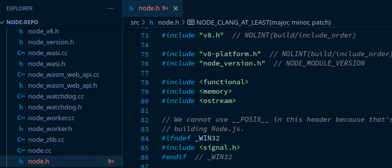

# The Node Core

`The Node Core`, no, it isn't the galactic police force from `Guardians of The Galaxy`, though that is a great film, nor is it the latest spinoff metal `genre`, though maybe you could create it! `The Node Core` is the `core` of `Node`, in this chapter we are going to get into exactly what this is. As we already mentioned, `Node` is a `C++` program, we can use `C++` to `bind` functions to `keywords` which `Node` will then look for in our `JavaScript` and run the `C++` function associated. We are going to take a look at the `core` `C++` code which relates to adding features to our `JavaScript`, building the foundation of what allows `Node.js` to be a web sever. We can access the `Node.js` codebase through [github](https://github.com/nodejs/node), just like `V8` it is open-source, you should clone this repository, maybe even follow `nodejs` and star the official repo if you wish!

You can also visit the [joyent](https://github.com/joyent) repository, here you will find the original `libuv` repository, we will get into this later for now just know that [libuv (new repository)](https://github.com/libuv) is the library through which `Node` interacts with the OS to perform tasks such as opening `websockets`. `Joyent` is of interest as it used to be the location of the original `Node` repository, and they still have involvement in the development of `Node.js`.

Okay, so lets put on our investigative hat, and get to work. Open the `Node` repository in your text editor of choice. In the file explorer there are a number of folders of interest (`FoIs`). We will start by looking at the `deps` folder.

 

| Folder | Description |
| --- | --- |
| deps | Dependencies built outside of Node that are part of Node |
| src | Source files |

 

Dependencies

If we open the `dependencies` folder we can see various `folders` including `npm`, `openssl`, `uv`, and `v8`. This is where our `v8` engine lives. Opening the `v8` folder you will  notice this is an entire project of it's own. In fact, every one of these dependencies is. When we have external libraries in our projects, we are using code that someone else has written, we usually install these into our project using a package manager, however, we can add them manually (though I wouldn't recommend it as it becomes difficult to manage/maintain). These `dependencies` are simply that; external `libraries`, but ones that are actually built into `Node` itself. You can navigate the source code of these libraries, just like any other project.

Source

In the `src` folder are all of `Nodes` source files, and there is a-lot. Here, one file of particular interest is `src/node.h`, this is the header file for `Node`, of the the `cpp` file would be the main run point for `Node`. In `C++` we split our files into `headers` and `source`, `.h` files contain our `headers`, these tell us what is required, it is kind of the blueprint for our functionality, and allows other devs to easily see how they can use and extend our classes without having to understand our concrete implementation in it's entirety. In this particular header, about 70 lines in, you will see that `v8` is imported, this is exactly what we would expect, the `v8` engine is used throughout `Node` to process and execute JS code. Understand that the `Node core` (or the `C++ core`) is a core of utilities built in `C++`, but made available to JS via the hooks in the `v8` engine.

 

So what is the point of this? the point here is to understand that `Nodes` is not a language, but it does extend `JavaScript` and add a huge amount of features that we just don't get in vanilla JS. The mental model you should have is not that `Node` IS `JavaScript`, `Node` itself is NOT `JavaScript`, `Node` ACCEPTS `JavaScript`, and extends the utilities of `JavaScript` through the power of `C++`. You should explore a few files of the `src`, try to understand at least parts, and cement the knowledge that THIS is `Node`, these are our utilities that we interact with. In the next chapter we will discuss `JavaScript Engines` in more generic terms.

___

[<< prev](./2_node.md) | [next >>](./4_engines.md)