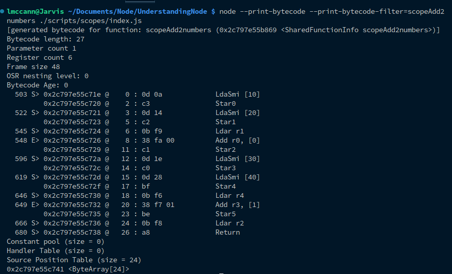

# JavaScript engines

In the previous chapter we spoke mostly of `Node`, it's `C++` core, and how this enables the extension of `JavaScript`s functionality. We know that `Node` uses the `V8` engine, and we know that there are many `JavaScript` engines, but what exactly is an engine? well, much like everything else, `JavaScript` engines are simply programs whose responsibility is to execute `JavaScript` code, the most popular of which is the `V8` engine. We know that this particular engine powers not only server-side applications outside of the browser via an embedded version of `V8` within `Node`, but also within the `chrome` browser itself. This posits a new question: what if you didn't use `chrome`? currently, the most popular browsers on the market are `chrome`, `brave`, `safari`, `edge`, and `firefox`, do all of these run the `v8` engine? the short answer is no.

Generally, `JavaScript` engines utilise the pipeline pattern. We begin with our JS code being passed to the `parser`, which then divides the code into multiple tokens. The generated tokens are further converted into an `Abstract Syntax Tree (AST)`. This is a tree-like structure that represents functions, conditionals, scopes, etc... The `AST` is  then passed to the `interpreter` which converts the `AST` representation into `bytecode`. Concurrently, the engine is actually running the `JavaScript` code, `bytecode` is used by optimising the compiler along with profiling data, optimisation of the compiler makes certain assumptions based on profiling data and produces highly optimised machine code. Occasionally the optimisation assumption will be incorrect, at this point the previous version is invoked by the `Deoptimise` phase. Usually, an engine will optimise hot functions and use inline caching techniques to achieve an optimal version of our code output.

 

 

| Engine | Description |
| --- | --- |
| V8 | Open-source Engine used by Chrome and Node |
| SpiderMonkey | Engine powering Firefox |
| JavaScriptCore | Open-source Engine developed by Apple for Safari |
| Rhino | Open-source Engine for Firefox |
| Chakra | Engine for Microsoft Edge |
| JerryScript | Engine for IoT |

 

Recall `JavaScript` is not understandable by the computer directly, it needs to be converted into a computer-understandable language, each engine handles this conversion differently, thus we have multiple engines. Whilst engines may vary in how they conduct this task they effectively solve the same problem in at least a similar manner.

V8

`V8` has an edge which elevates it above other engines (there is a reason it became so popular!). Not only can `V8` run both on the browser and directly on a machine using `Node` but, as we learned previously, we have control over expanding the functionality ourselves due to `V8`'s open-source nature. `V8` may also be embedded into any `C++` application we write; it also allows for `JavaScript` code to run much faster (which improves the end user experience), paves the way for the development of web applications (and SPAs), and allows smaller teams of devs specialising in `JavaScript` to operate across the entire stack.

Using it's proprietary parser, `V8` generates an abstract syntax tree, after which `Ignition` (the `interpreter`) generates `bytecode` from this tree using the internal `v8` `bytecode` format. `Bytecode` is then compiled into machine code by `TurboFan` (the optimising compiler), which also handles the memory allocation for objects where garbage collection collects the objects which are no longer required. `TurboFan` utilises optimisation techniques such as [elision](https://www.geeksforgeeks.org/copy-elision-in-c/) (the art of omitting unnecessary objects from a copy) of expensive runtime properties, and inline caching. The garbage collector is a generational incremental collector (a collector which does not collect all unreachable objects during a cycle, all generational garbage collectors are incremental, an incremental GC does not necessarily employ a generation scheme to decide which unreachable objects to collect or not, as such it instead divides the unreachable objects into different sets (roughly according to their age). The basic theory here is that the objects most recently created will become unreachable quickly, so the set of "young" objects are collected at an early stage. An incremental collector may be implemented with this scheme, or another alternative method, which may decide which group of objects should be sweeped in a different manner [see Wiki](https://en.wikipedia.org/wiki/Garbage_collection_(computer_science)#Generational_GC_.28ephemeral_GC.29)). `SparkPlug` is a recent addition to `V8`, present between `Ignition` and `TurboFan`, also known as the `Fast Compiler`, it is designed with one thing in mind: <em>compile fast, very fast</em>. This allows us to compile whenever we want, it does this by cheating; the functions it compiles have already been compiled to `bytecode` and the `bytecode` compiler has already done most of the work with things like variable resolution, arrow-functions, desugaring destructable statements, and son on. The second trick is that `Sparkplug` does not generate any `intermediate representation` (`IR`) like most other compilers do, instead, it compiles directly to machine code in a single linear pass over the `bytecode`. The whole compiler is actually just a switch statement, within a for loop, the lack or IR means that the compiler has limited optimisation opportunity, it also ports the whole implementation for each supported `processor` architecture.

 

Chakra

Our next engine is `Chakra`, this is an engine developed by `Microsoft` as proprietary software. `Chakra` is used in the `Internet Explorer` web browser, a key feature of this is that it use `just-in-time compilation`, this is a way of executing computer code that involves compilation during the execution of the program. `Chakra` does this on a separate core parallel to the browser process.

Spider Monkey

Yes, this is a strange name for an engine, it sounds like some sort of `spider-man` knockoff, but actually, it was the first `JavaScript` engine, and is currently maintained by `Mozilla`.

Webkit

Webkit engine is developed by `Apple` and used in the `Safari` browser, as well as on all other `IOS` browsers, this includes `PlayStation` consoles from sony, and even with certain `Amazon` kindles. Webkits `C++` API provides a set of classes to display web content in windows, implements browser features such as following links, managing back-forward lists, history, and more.

 

## Parsing

The `v8` parser also has a pre-parser, but in an admission from `google` the pre-parser is actually currently useless for most modern JS. Additionally, the inner functions must be re-parsed unless they are compiled in the outer function, this means that unless we wrap our functions, they are lazy loaded, unlike variables which are eager loaded, below is a code example of this.

<pre>
<code>
// variable declarations are eager parsed
const a = 1;
const b = 2;

// functions are lazily parsed due to the cost of eager parsing
// since we don't need it right away.
function sum(...args) {
    return args.reduce(function (acc, cur) {
        return acc + cur;
    })
};

// the parser returns to parse the sum as we use it
sum(1, 2, 3);
</code>
</pre>

Here our declarations will be eager parsed, however, the function is instead lazily parsed, this is great for performance as a lazily parsed function has a cost at a `1*x` flat-rate on initial load, x being the additional unknown cost of conducting scope resolution of inner functions and serializing it. However, once this function is actually used the flat-rate goes up to `3*x`. We can instead force functions to eager load by wrapping them.

<pre>
<code>
// variable declarations are eager parsed
const a = 1;
const b = 2;

// since we wrap this in an IIFE (immediately invoked function expression)
// the function is eager loaded into memory right away.
const sum = (function(...args) {
    return args.reduce(function (acc, cur) {
        return acc + cur;
    }, 0)
})();

// we can use this right away as we have eager parsed
// alreadyarray
sum(1, 2, 3);
</code>
</pre>

The advantage of eager compilation is that we can drop the `3*x` cost to `2` for all top-level functions known to be executed immediately. It only matters from the top-level though. If we don't decide to eagerly parse as part of the main compile job
we may as well wait until it is executed, since then at least we are certain that we only pay the compile cost (`2` for parse, `2` for compile) for functions we actually use. This applies to the above example where we have an `accumulator` function declared within our function, since the top-level is the only part which matters in this circumstance we eager-load the top-level function, however, the inner `accumulator` will still only be loaded as and when it is used.

The downside of this? eager compilation requires us to keep the AST around in memory between the parse and compilation steps. This increases peak memory usage significantly, if we could pre-parse inner functions of eagerly parsed functions this would probably work out better. On low-memory devices, it would be better to disable eager heuristics entirely. Theoretically the data could be serialized on a warm startup, this way we never need to look at unused code making top-level compilation heuristics irrelevant.

## Interpreter

As asserted earlier, `Ignition` is the interpreter used for `V8`, as such, we will focus our discussion here particularly on `Ignition`. `Ignition` is another type of engine; what we would refer to as a `Register Machine`. In terms of mathematical logic and theoretical computer science a register machine is a generic classification of machine used in a manner similar to a `turing machine`. As a quick overview, once the `register machine` is created it creates a virtual `bytecode` which is abstracted away from any particular machine implementation, this will run through the `optimisers`. Eventually this runs through the `compiler`, which produces the machine specific code for our particular processor. It is possible to view this code in any given script using the `node` flag `--print-bytecode`, additionally we may provide a `filter` flag with this to condense down our output to only display the `Machine Code` to our particular function.

<pre>
<code>
node --print-bytecode --print-bytecode-filter=[functionName] [filename]
</code>
</pre>

Remember, when we compile to `Machine Code` there can be a lot of `bytecode` generated. It is also often difficult to understand if you have not been exposed to it before, to illustrate this point I have created a script with a function `return5`. This function is incredibly simplistic, but if we output the `bytecode` we get:

 

Code            |  Bytecode
:-------------------------:|:-------------------------:
  |  

 

Taking a look at the `bytecode` we see that on the second line down we have the name of the function, followed by the pointer to the function. We also see a count of parameters, registers, nesting level, age, and a frame size. We then move down to our first command (`LdaSmi 5`) followed by a `return`. This is an interesting section, we can see that the return
outright matches to our JS, this means we already know, instantly, that this is the
return of our function. As for the more interesting `LdaSmi`, this is actually a
command; `Ld` standing for `load`, `a` for `accumulator`, `Smi` : `Small integer`. Putting all this together, the command can be interpreted as; "<em>load into the accumulator a small integer of the value 5</em>". This is a piece of `Assembly`, meaning it is in a human readable form, if we traverse a little further to the left, we see `0d 05`, a piece of hexadecimal, `0c` being our instruction code `05` being the number value. Should we change this to `return7` this number will change accordingly (give it a try!).

### The Accumulator

The accumulator is ancient in terms of computing technology. it is a register in which the intermediate arithmetic logic unit results are stored and bares resemblance to the original `Turing Machine`. It is also a part of the `Von Neumann Architecture` pictured here:

The accumulator is essentially a store close the `CPU` in memory, it has fast access, much faster than main memory, anytime we want to conduct arithmetic via the `APU` the results are stored by the accumulator. As stated, this is far faster to access than main memory, allowing us to conduct rapid calculations. Hence, `LdaSmi[5]` loads the value into the accumulator, specifyies the value type as a `small integer` (a `small integer` being an integer of roughly half the bytes of a normal `integer`, with normal `integers` usually being around `4 bytes` this makes `small integers` commonly `2 bytes`).

If we consider the next statement, `Return`, we know what a `return` usually does, it ceases execution of a function and returns the value to the right in terms of JS code execution. But, what does it do in the context of the `accumulator`? as you may have guessed from the fact we are talking about the `accumulator`, in this context `Return` returns the `value` which is currently stored within the `accumulator` itself, since we `load` the integer `5`, the return value will be `5`. If we simulate the `accumulator`, the first thing which happens is we enter the function, at this point in time the `accumulator` is blank. The first instruction executed is our `LdaSmi` instruction. This `loads` our value into the accumulator, at which point the accumulator now has value. Next we `Return` the value in the accumulator and `end` the below table shows the accumulator value changes.

 

| Instruction | Accumulator |
| --- | --- |
| <strong>[begin]</strong> | - |
| LdaSmi[5] | 5 |
| Return | 5 |
| <strong>[end]<strong> | - |

 

Just to really cement this in your mind, we can also simulate this using `JavaScript` itself, it is often a pattern used in loops. Go ahead and run the script provided in `scripts/accumulator`, logging to `bytecode` to the console. Take a
look at the `bytecode`, notice that this is doing exactly the same as the function previously. Note the interaction within the `accumulator` as to how the value changes and understand that this is what occurs inside of your `APU` when the processor runs this.

<pre>
<code>
    // [] - This variable simulates our accumulator
    let accumulator;

    // LdaSmi[5] - here we set the value of the accumulator
    accumulator = 5;

    // [5] - Lastly we return the value inside the accumulator
    return accumulator;
</code>
</pre>

### Register Machines

Right, now that we know what an `accumulator` is we can head back to our original discussion `Register Machines`. `Registers` are used by the `accumulator` to store values for use at a later point of execution. If we want to define a `register` we can use the official definition "<em>A storage slot capable of storing a natural number</em>" simple right? it is somewhat like the `accumulator` in this manner, simply a piece of virtual memory for storing some value, provided that value is a natural number. When executing your code, every declaration you make is stored within a `register`. For this example we will use a slightly more complex function in `scripts/register`, you should output the `bytecode` of this function for analysis.

 

Code            |  Bytecode
:-------------------------:|:-------------------------:
  |  

 

From our `bytecode` we can see the same command as before (`LdaSmi`). From this we now know that we are loading a value of the type small integer into the `accumulator`. The next line down from this however, we see a new command `Star0`. Since we are talking about registers you can probably deduce that the `r` stands for `register`, `St` stands for `store` and, as before, `a` stands for accumulator. If we put this together we are saying "<em>Store the value in the accumulator at register 0</em>". Notice, we also have the `register count` which is now set to `1`.

Next we see `AddSmi [5]`, the `Add` part is a mathematical operation, here we are saying to `add` the value provided to whatever `value` is stored in the `accumulator`, in this case `10`. Every identifier/declaration you make in `JavaScript` will have a representation mapped to a virtual register for it. In this case we assign `10` to `x`, this means that `x` will be mapped to virtual register `r0`. This may seem quite inefficient, we are assigning a value to `r0` but we don't actually do anything with it. This is where `compilation` and `optimisation` phases come in after we compile down to the virtual `bytecode`.

| Instruction | Accumulator | Register0 |
| --- | --- | --- |
| <strong>[begin]</strong> | - | - |
| LdaSmi[10] | 10 | - |
| Star0 | 10 | 10 |
| AddSmi[5] | 15  | 10 |
| Return | 15 | 10 |
| <strong>end</strong> | - | - |

If you want an adequate JS representation of this behaviour, as we did previously, take a look at the following code:

<pre>
<code>
function add5() {
    let accumulator;
    let r0;

    accumulator = 10;
    r0 = accumulator;

    accumulator += 5;

    return accumulator;
}
</code>
</pre>

Try out some different functions, check the `bytecode` for them, what happens if instead of setting a variable we simply return the result of the calculation for instance? to answer this question in particular you should write a simple function where to numbers are added, you will notice in the bytecode we only get one command run `LdaSmi`. This is because the `interpreter` is optimising our code, it knows we are taking two numbers and adding them together, so rather than waste the operation it just sets the result to the `accumulator`.

Lets get a little more complex, how about adding two numbers.

 

Code            |  Bytecode
:-------------------------:|:-------------------------:
  |  

Here we see much of the same, except our `register count` is now `2` rather than `1` as before.
This is because, as mentioned previously, every declaration we make will be associated with it's own
virtual register. If we trace this through we first find that we have our `LdaSmi` loading the small integer
`10` into the `accumulator`. The next line down we `store` the value currently in the `accumulator`, currently `10`,
into `r0`.  We then load our second value (`5`) into the `accumulator`, this replaces the `accumulator` value.
Next `Star1` runs, this looks familiar, we can deduce that this command is storing the current accumulator value
again, but notice, it is going to `r1` rather than `r0`. In the next step we see another new command `Ldar` we
know that `Ld` will load a value, we also know that `a` is the `accumulator` and `r` is `register`, thus;
"<em>Load the current register1 value back into the accumulator</em>". After this we run the `Add` command on `r0`, which, as
discussed previously, will add the value, this time in `r0`. Finally, we `return` the `accumulator` value.

 

| Instruction | Accumulator | Register0 | Register1 |
| --- | --- | --- | --- |
| <strong>[begin]</strong> | - | - | - |
| LdaSmi[10] | 10 | - | - |
| Star0 | 10 | 10 | - |
| LdaSmi[5] | 5 | 10 | - |
| Star1 | 5 | 10 | 5 |
| Ldar r1 | 5 | 10 | 5 |
| Add r0 | 15 | 10 | 5 |
| Return | 15 | 10 | 5 |
| <strong>[end]</strong> | - | - | - |

We can yet again simulate these exact steps using JS for clarity:

<pre>
<code>
function add5() {
    let accumulator;
    let r0;
    let r1;

    accumulator = 10;
    r0 = accumulator;

    accumulator = 5;
    r1 = accumulator;

    accumulator = r1;
    accumulator += r0;

    return accumulator;
}
</code>
</pre>

 

### Scopes

When generating the `bytecode` we have the option of using `var`, `const`, or `let` for creating variables. If you haven't already guessed, each of these have differences in the generated `bytecode` due to `scope`. First of all we will use the `add2numbers` function in the `scripts/scopes` directory. When we generate the `bytecode` for this it is just the same as we had prior (as we have used `const` already to declare our variables):

 

| Instruction | Accumulator | Register0 | Register1 |
| --- | --- | --- | --- |
| <strong>[begin]</strong> | - | - | - |
| LdaSmi[10] | 10 | - | - |
| Star0 | 10 | 10 | - |
| LdaSmi[20] | 20 | 10 | - |
| Star1 | 20 | 10 | 20 |
| Ldar r1 | 20 | 10 | 20 |
| Add r0 | 30 | 10 | 20 |
| Return | 30 | 10 | 20 |
| <strong>[end]</strong> | - | - | - |

 

Now filter to use the `let` version of the function. Notice any difference? exactly! from a `bytecode` perspective `const` and `let` produce exactly the same results. There may be some difference prior to this in the `parsing` phase, but after this point the `bytecode` generated is exactly the same. `const` is declared and `immutable`, you can only change the reference not the value. This is usually more effective and we should use `const` by default, it makes our code simpler, cleaner, and makes us think twice before reassigning a value to the same variable.

Now try generating the bytecode for `funAdd2numbers`. This code will throw an exception, this is because we are using a variable before it's declaration. We receive an interesting response in the `bytecode`.

 

 

The very first command here `LdaTheHole`, we know that `Lda` is telling our processor to `load` into the `accumulator` at this point, but what exactly is this value `TheHole`? this is a value that should never happen, it represents our declaration of `n2` in our code, where we declare it after it has already been used. This shouldn't exist, as we just stated, yet `TheHole` is loaded into the `accumulator` at this point. This is because we have to have a register for every declaration, this means it has to have some value, it cannot be undefined, as it is not yet initialised. Thus, the way `v8` handles the undeclared variable is to refer to it as `TheHole`. We can see further down we `load` the value of `r2` into the `accumulator` again, right after this, if `TheHole` still exists (no value has been assigned) then a reference error is thrown via: `ThrowReferenceErrorIfHole`. The reason for this is that if we simply set this register to `undefined` the behaviour would then be the same as using `var` (which has a global scope), the reason we prefer `let` and `const` is because they are block-scoped, this means we cannot access them from just anywhere in the application, making for greater traceability, along with less complexity due to imperceptive `magic` occurring.

 

| Instruction | Accumulator | Register0 | Register1 | Register2 |
| --- | --- | --- | --- | --- |
| <strong>[begin]</strong> | - | - | - | - |
| LdaTheHole | TheHole | - | - | - |
| Star2 | TheHole | - | - | TheHole |
| LdaSmi | 20 | - | - | TheHole |
| Star0 | 20 | 20 | - | TheHole |
| Ldar r2 | TheHole | 20 | - | TheHole |
| ThrowReferenceErrorIfHole | TheHole | 20 | - | TheHole |
| <strong>[error]</strong> | - | - | - | - |

 

Now try filtering the `bytecode` output to our `validFunAdd2numbers`. Notice this function is exactly the same declaration, except, our `n2` declaration is now in the `global` scope. This variable becomes available due to the JS concept known as `hoisting` where the declaration is `hoisted` to the top of the execution, this means that although the `var` declaration sits below its usage it is `hoisted` to the top of the execution and therefore available prior to it's definition. Generating the `bytecode` for this function you should see that we are back to having `clean` looking `bytecode` as we have seen prior. The interesting thing you will notice here is that three instructions in we have `Ldar2`. As we know, this will load the value from `r2` into the `accumulator`, however, we haven't actually loaded a value into `r2` yet, as this is the var which has been `hoisted`. For `registers` if we haven't set a value in the register which is being accessed, the value is instead set to `undefined`. Noting the table below you wll notice that each time we do our addition within the `accumulator` we will be adding `undefined`, this means our result in the `accumulator` at each phase will be `undefined` (<em>n + undefined = undefined</em>). This is exactly how `hoisting` and `scopes` work at the lower level.

 

| Instruction | Accumulator | Register0 | Register1 | Register2 |
| --- | --- | --- | --- | --- |
| <strong>[begin]</strong> | - | - | - | - |
| LdaSmi[20] | 20 | - | - | - |
| Star0 | 20 | 20 | - | - |
| Ldar r2 | undefined | 20 | - | undefined |
| Add r0 | undefined | 20 | - | undefined |
| Star1 | undefined | 20 | undefined | undefined |
| Ldar r2 | undefined | 20 | undefined | undefined |
| Add r0 | undefined | 20 | undefined | undefined |
| Return | undefind | 20 | undefined | undefined |
| <strong>[end]</strong> | - | - | - | - |

 

Our final example here is going to be with `scopes`. You will find the function for this in the same location as the prior functions, filtering the output to `scopeAdd2numbers`. You will notice in the JS we have declared another scope within the function using `{}`. This scope contains calculations using variables named the same as the variables within the upper scope, however, notice we are using `block-scoped` variable declarations as well. What do you think will happen here? You should expect that the return value will be `30` as the inner scope will not affect the outer scope, although we are using the same variable names the outer declarations are out of scope within the inner scope, thus are treated as different variables, however, if you log in the inner scope you should expect to see `70`. Lets take a look at how this is handled in our `Register Machine`.

 

 

The first thing you should take note of is the number of `registers`, notice there are now `6` where in our preexistent example there were but `3`. This is already evidence of the behaviour we suspected to occur, we have double the number of registers, because we have a register for each declaration. This means, whilst our variables are sharing a name, they are considered entirely different declarations due to their scope. Notice however, that the `bytecode` itself does nothing different, it does not care for `scope` in the slightest, all it is doing is assigning registers, the `scoping` itself is actually done in the `parsing` phase at the `AST` level. You can test this by removing the scope from the function, and changing the variable names so that the code runs, you will notice the exact same `bytecode` is generated.

 

| Instruction | Accumulator | r0 | r1 | r2 | r3 | r4 | r5 |
| --- | --- | --- | --- | --- | --- | --- | --- |
| <strong>[begin]</strong> | - | - | - | - | - | - | - |
| LadSmi[10] | 10 | - | - | - | - | - | - |
| Star0 | 10 | 10 | - | - | - | - | - |
| LdaSmi[20] | 20 | 10 | - | - | - | - | - |
| Star1 | 20 | 10 | 20 | - | - | - | - |
| Ldar r1 | 20 | 10 | 20 | - | - | - | - |
| Add r0 | 30 | 10 | 20 | - | - | - | - |
| Star2 | 30 | 10 | 20 | 30 | - | - | - |
| LdaSmi[30] | 30 | 10 | 20 | 30 | - | - | - |
| Star3 | 30 | 10 | 20 | 30 | 30 | - | - |
| LdaSmi[40] | 40 | 10 | 20 | 30 | 30 | - | - |
| Star4 | 40 | 10 | 20 | 30 | 30 | 40 | - |
| Ldar r4 | 40 | 10 | 20 | 30 | 30 | 40 | - |
| Add r3 | 70 | 10 | 20 | 30 | 30 | 40 | - |
| Star5 | 70 | 10 | 20 | 30 | 30 | 40 | 70 |
| Ldar r2 | 30 | 10 | 20 | 30 | 30 | 40 | 70 |
| Return | 30 | 10 | 20 | 30 | 30 | 40 | 70 |
| <strong>[end]</strong> | - | - | - | - | - | - | - |

 

That is as far as we are going to delve here for now. I hope this isn't too much information all at once,
if you are struggling to understand this, stay here, play around, and explore until you have a grasp
on what this is doing at a low level. In the next section we are going to discuss `parsing` some more,
mostly in the context which we will be using it in `Node` and `JavaScript`. We touched on this briefly
in this chapter, however, we will delve into greater detail as to how we can use this information
in development, how it can help us to understand our code at a lower level, how the `callback queue` works,
and how we are able to run our extended `C++` functions in the browser, and on our `server` from `JavaScript`
to gain additional functionalities not available in JS.

 
___

If you'd like to learn   more about parsing  
digital ocean have a   great article available   [here](https://www.digitalocean.com/community/tutorials/js-v8-engine).

If you'd like to learn   more about the  
Von Neumann Architecture   [click here](https://www.sciencedirect.com/topics/computer-science/von-neumann-architecture).

 

___

[<< prev](./3_nodecore.md) | [next >>](./5_parsing.md)