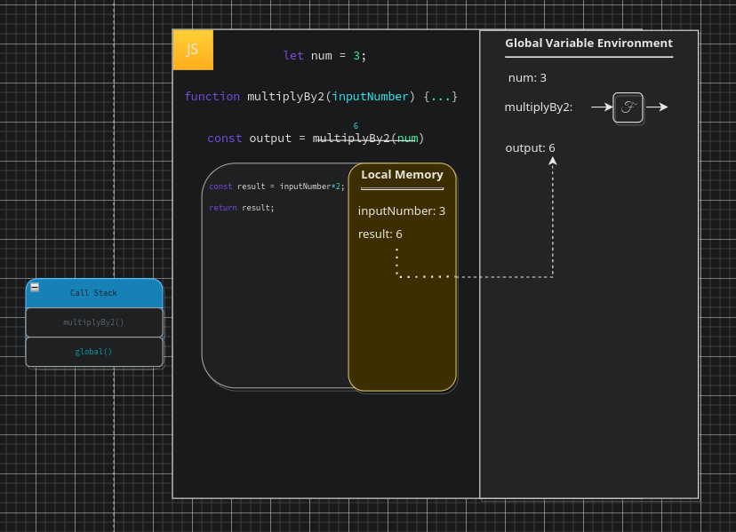

# JavaScript Execution

To truly understand `JavaScript` execution we must understand a few concepts. First of all, that JS holds a data store, this store is what we call the `Global Variable Environment (GVE)`, it is where we store all of our declarations in JS, or in more simplistic terms "Memory". This is opposed to our `Execution Context (EC)` it is available throughout our script throughout the whole time of our execution, unlike our `EC`s created when we run a function which store data inside the function itself which is lost upon the completion of the `EC`. Whatever terminology we may use, be it `declare`, `register`, `define`, `assign`, all mean the same thing, they mean <em>"Take the item and save it in memory"</em> or as a function <em>"Take the code, and it's arguments, don't execute it now, save it in memory for later"</em>, this terminology can be somewhat misleading as it suggests the `engine` is vaguely aware of the function at this point, however, it is not, JS does not "go back" to the line, it holds onto the data in memory to use when the function is run. In this sense we can think of a function as a means of bundling up code to run at a later time. This implies that any time we want to save code to run later we can simply wrap it in a function to attain this behaviour.

We will begin by looking at an example in which we are going to follow the `thread of execution`. This is the method in which JS reads the code line-by-line, however, in doing so we will see just how JS is interacting with the `GVE`, later this will assist us in understanding how `Node` helps JS interact with the OS. Below is the code we will execute, this is an example from one of my favourite online lecturerers [Will Sentence](https://frontendmasters.com/courses/servers-node-js/executing-javascript-code-review/) who explains all of this in excrutiating detail with multiple series of videos covering the subject in differing contexts.

<pre>
<code>
    let num = 3;

    // Save the function to GVE
    function multiplyBy2 (inputNumber) {
        const result = inputNumber*2;
        return result;
    }

    // Invoke function and insert argument
    const output = multiplyBy2(num);
</code>
</pre>

We begin reading the code `lexically`, as such, we begin at the top just as JS does and our firstline: declaring a variable and assigning it a value of `3`. This is simple enough, I am pretty sure most of you have covered this already. The interesting part here is what actually happens under the hood when we write this, if you look at the `GVE` diagram below, you will see that upon execution a value is stored in the `GVE` with an assigned `label` and the `value` we assigned to it.

Not too difficult yet right? so what happens when we read the next line? this is where some more junior devs might get confused, it can be instinctive that because we are executing the script line-by-line that the function declaration will begin and start executing what is inside of the function. This is incorrect, at this point the `engine` does not care what is inside of this function, it sees the keyword function and saves the whole function to the `GVE`. This is JS `saving` the code for later, don't get confused, JS doesn't come back to this code, it doesn't somehow magically jump back up to here during execution, though in the `debugger` it can give this illusion, no, it saves this function to the `GVE`, including any variables packaged with it in the functions little backpack store, known as the `Persistent Lexical Scope Referenced Data ` which all functions in JS have (this is how `closures` work), of variables for later use, it is never coming back here, so it needs to make sure it has this saved.

We do not enter the function yet, we only enter a function after it has been `invoked` and, as we know, we invoke a function using parenthesese. Instead, we move down to our declaration of the `output` variable. In this we assign the output of a function call to multiplyBy2 passing the argument of the variable `num` which evaluates to `3`. Thus we actually end up with: `output = multiplyBy2(3)`. Now we have parenthesese on our function we have `invoked` the function `multiplyby2` with the argument `3`, what happens? in short, we open up a new `Execution Context` specifically a `Functional Execution Context`.

It can be useful to think of `Execution Contexts` as `Miniature Apps`, they still contain the two concepts we see within the `Global Execution Context`, the two main concepts of `JavaScript`:

- The Thread Of Execution
- The Global Variable Environment

These two things together build up the `Execution Context`. You can see the `Execution Context` within the below diagram as a min-terminal under the declaration which assigns the function. So, we enter the new `Execution Context`, what is the first thing we handle? the assignment of our `parameters` and `arguments` in local memory of course! notice our function has an `inputNumber` passed in, as we already stated, we know this will evaluate to `3`, in local memory we pass save this with the `parameter` (the `label`) on the left and the `argument` (the `value`) on the right, the `parameter` is named as such as it is merely a placeholder for our actual value, when the function is run it updates this in local memory to hold the `value` of our `argument`.

The next line, we set the result within the `function` to `inputValue*2`, we evaluate the calculation first, setting the `result` in memory to the value of `6`. Remember, this is being set in `LOCAL` memory, once the function exists this `Execution Context` all information stored here is lost. Thus, we come to our final line, the `return` statement, the `return` statement says to JS <em>"Locat ehte block of memory bound to the `label` result and return it out of the `function`"</em>, as such, our result evaluates to `6` and the evaluated output `6` is assigned to the `output` variable. Here you can see the `Thread of Execution` in action, we only have one thread, therefore, anytime we enter a function we must weave into said function, execute each line within that `context`, and then exit out to our outer `context`. As alluded to in the previous chapter this means we can only do one thing at a time in JS.

So, how does JS keep track of the `Execution Contexts` you ask? via the `Execution Context Stack` (AKA the `Call Stack`). The call stack initializes with the `Global Context` and then adds contexts to the top of the `stack` as they are created, running whatever happens to be atop of the stack at the time. This is also how JS hoisting works, allowing us to access variables from outer contexts, when finding a variable JS will check the initial `scope` first, but if it does not find a declaration in the immediately it can check the `outer` contexts to see if it exists there, if it reaches the `Global Context` and it is still undefined it will either declare a implicit value (undefined) or throw an error in strict mode. As soon as we hit `return` the item on the top of the call stack is popped off. The diagram indicates this by the greying out of the function on the callStack with the global context call being set in `blue`. These are the three key pillars of JS, the main concepts to grasp, it is important to reiterate that after these contexts `return` the only thing stored is the `returned` value, all `local memory` dies with the context.

