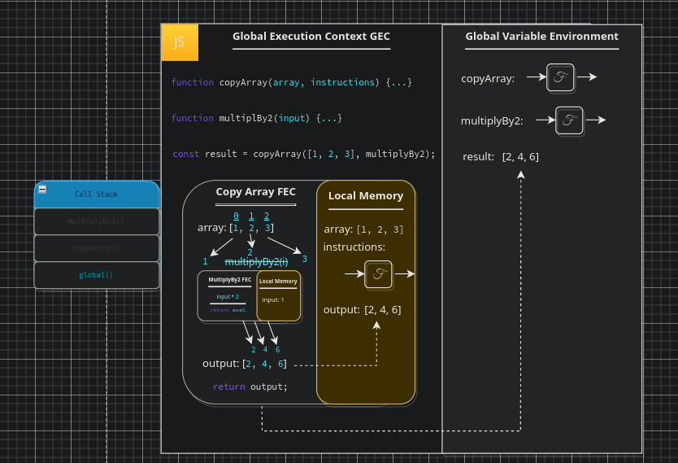

# Higher Order Functions

In `JavaScript` functions are far more versatile than most languages, hence the rise of functional programming. This is greatly due to the fact that JS functions are `first-class`, meaning can be used just as any other data type in JS. This enables us to assign functions as values to variables, pass them around to other functions, and more. When we use the term `Higher Order Functions` we are referring to a process in which we can pass functions to other functions, this can be simplified as "<em>A function which accepts and/or returns another function</em>". We refer to these functions as <em>higher-order</em> because contrary to strings, numbers, and booleans, it goes <em>higher</em> to operate on functions. A `Higher Order Function` does not necessarily have to return a function to be considered higher-order, but must meet one of the following criteria:

1. The function takes one or more functions as an argument.
2. The function returns a function as a result.

In JS `first-class` functions can:

1. be stored as variables.
2. be used in arrays.
3. be assigned as object properties.
4. be passed as arguments.
5. be returns from other functions.

There is an important concept to grasp prior to us delving into the execution of `HoF`s. Everything we use in JS is an `Object`, we can tell this using `instanceof`, try it yourself, set a `function` to a variable, an `array`, and `Object`, or anything else for that matter and use `<var> instanceof Object` to determine whether or not the item is an object. This can seem strange coming from other languages, however, it means we always have access to the Prototype chain of the object, following on from this, we also have access to Object methods, even when working with arrays etc... however, it can complicate validation and type checking as we need to learn to distinguish between arrays and Objects using alternative methods as to what we might be used to, or additional checks. Now lets take a look at the execution of a script using `HoF`s.

## Higher Order Function Execution

So, what happens when we have a function that does almost the same as another function and we want to add another case? (e.g. `copyArrayAndDivideBy2` and `copyArrayAndDivideBy3`) in this circumstance we may find ourself writing another function with the same logic twice. This breaks our `philosophy` we should be keeping out code `DRY` (Don't Repeat Yourself!). This is where a `HoF` would be useful, would it not be better to have a function `copyArray` that could take in some code as a parameter? that could then execute that code as part of it's own execution? in that sense we could reuse this function and decide on part of it's functionality at runtime.

<pre>
<code>
function copyArray(array, instructions) {
    const output = [];
    for (let i = 0; i < array.length; i++) {
        output.push(instructions(array[i]));
    }
    return output;
}

function multiplyBy2(input) { return input * 2; }
const result = copyArray([1, 2, 3], multiplyBy2);
</code>
</pre>

Lets step through this, on the first line we store the definition of our function to the `GVE`. The next line down we also store the definition of `multiplyBy2` in the `GVE`. So far so good, we then defined the parameter `result` in the `GVE`, which is assigned the `evaluated` value of `copyArray`. At this point the JS `engine` creates a new `FEC` and we enter the context of the `copyArray` function with the first argument as our array, and the secondary argument of our entire function definition for whatever code we want to inject, in this case `multiplyBy2`. Until this evaluates `result` itself id `undefined` in memory.

Within our `FEC` we first set our arguments in the local memory to their parameter "labels". In this case we have an interesting case, the first case is `array` which has the argument set `[1, 2, 3]`, the second is our `instructions`. What do you expect `instructions`argument to be? well, given we have passed the entire function definition, and we know that JS will not return here later, we can deduce that the argument set to `instructions` here is the entire function definition of `multiplyBy2`, should we want to access this function we must now call it via it's assigned "label" (parameter name) `instructions`.

The first line of our first `FEC` defines a constant `output` assigned an empty array as the argument value, this is nothing we haven't already seen prior. The next line is where things get interesting. Here we have a `for loop`, now what can we deduce from what we already know about JS execution? lets break it down; first of all we define a variable `i` with the value of `0`, in memory we know this would assign a `parameter` `i` with the `argument` assigned of value `0`, so far so good. We can also determine that this value will increment on each pass, as we know how for loops work. This means we will run the process within the for loop `n` times, where `n` is the length of the array. The process we will run `n` times in this case is our `output.push`, however, note that the item we are pushing unto our output array (defined in memory) is not a primitive value but an `evaluation` from our `instructions` function call. This function call is performed on `i`, the current index of our `for loop`, thus each item in our passed `array` will run the function `multiplyBy2` which has been assigned to our `instructions parameter`, this will create a new `FEC` for each item as each is an entirely new function call.

Thus we reach the first call to our `multiplyBy2` function. First of all a new `FEC` is opened and our argument of the value `i` passed. In this case `i` evaluates to the index `0` of our array which itself is a value of `1`. Henceforth, our new `FEC` sets the `property` `input` to the value `1`. Right away, we have a `return` which returns the evaluation of the multiplication `input * 2`, in this case `input` equates to `1`, therefore our resulting value evaluates to `2`, this value is returned from our `FEC` and the `FEC` is terminated, remember, all local memory is lost with the execution context, only values which were returned will persist into our outer context.

At this point we are back within our `Copy Array FEC`, we have evaluated our `instructions` function call for the first element of or array and received a value of `2`, surrounding our evaluated result are parentheses, these belong to another function `push` which exists on all array-like structures. `Push` is a method call just like our own function `multiplyBy2`, however, in this case it is on the array itself. This method appends the values provided to the end of the array, we will not step through this as we can assume the behaviour, just know that this is a function call, the result of which is our `evaluated` value being pushed unto our `output` array.

This exact cycle continues for each element of the array, try to trace this through yourself, use the diagram for assistance if you need to. Remember, each time you call a `function` it is added to the `call stack` and removed from said `call stack` when we exit the execution context. Upon reaching the end of our `for loop` we return the `value` of `output` to our `GEC` setting it as the `argument` to our `result property`. Take a moment to fully appreciate what has happened here. We have effectively defined a function which enables us to inject code at runtime, we have in no way predetermined as to how our function will mutate our array within the function itself, and if we so wish we could even swap out `multiplyBy2` with any other form of manipulation and the function will apply it to each item in the array at runtime, effectively we have created a placeholder for behaviour, we may not be able to `edit` functions, however, this is almost the same as being able to `edit` a function, enabling us to swap out functionality within a function easily without force of repetition by any means.

 

 

Take your time to study and really understand this diagram. For ease this has been condensed into a single diagram, but recall,in reality we are running through the array items one at a time, we are also opening and closing one execution context per `function` call/return. The main takeaway here is how JS is spinning up execution contexts with local memory which dies with the context, that we can have execution contexts within execution contexts, and that the `call stack` has items added to it when a function is called, and popped from it when execution completes. Finally, recall that higher order functions are a function which may receive or return another function, as is such they naturally have nested execution contexts, enabling us to define functionality when the function is called rather than at the very moment we write the function. In the next chapter we will discuss `callbacks` in detail, analysing how JS `engine` runs and utilises callbacks in the same manner we have here.

___

[<< prev](./6_jsexecution.md) | [next >>](./)