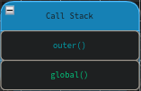
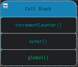
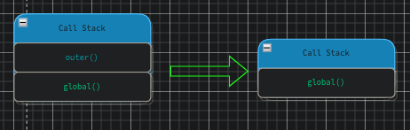
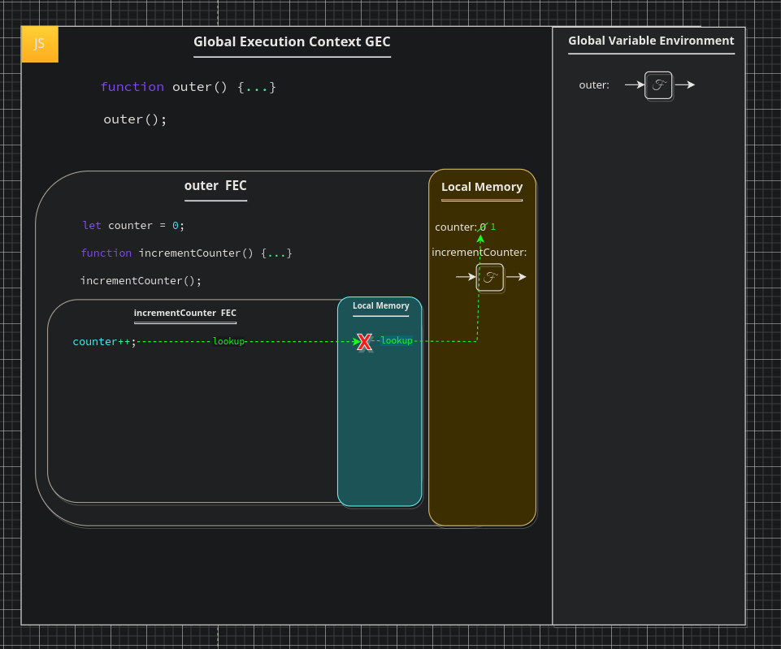

# Callbacks & Closures

Though you may not have realised it we have already looked at a `callback` in the previous chapter. Yes, the outer function  of `copyArray` is a `Higher order Function`, but our inner function that we pass in as `instructions` (`multiplyBy2`)? that is our callback function. So, how does this differ from the concept of a closure? it is simply by their definitions:

Callback

<blockquote>
"A callback is executable code that is passed as an argument to other code."
</blockquote>

 

Closure

<blockquote>
"A closure is a function that is evaluated in an environment containing one or more bound variables. When called, the function can access these variables."
</blockquote>

In practice, this means that a "closure" is a function with some hidden variables. I find we can understand this concept better with an analogy, once again defined very well by [Will Sentence](https://frontendmasters.com/courses/javascript-hard-parts-v2/closure-introduction/). Will asserts that closures may well be the most esoteric concept in JS, and I am inclined to agree though have experienced that `promises` and `async` in general often cause as much confusion with developers newer to JS. If you aim at one thing, aim to truly understand `closures`, they become incredibly powerful, allowing us to write professional level functions that we can write once and reuse. We can even use `closures` to turn other functions into functions that can only be run once. We can also utilise them for `memoisation`, a core performance optimisation concept which allows us to avoid repeating expensive calculations unless we need to re-calculate them. Many design patterns use this concept: Iterators, partial application, currying, maintaining state, asynchronicity.

We should first revise the principles we covered previously. We know that each time a function is invoked a completely new execution context is created containing a new `local memory`. When we exit the execution context the context and local memory are destroyed, any items not returned from the function are henceforth lost, there is no way for the next running of the function to recall the previous running of said function. This is known widely by developers from all backgrounds, but, what if we could? what if when we run a function we could run that same function later and it would not only have an account as to it's previous value, even if it wasn't returned, but also have it's memory/variable environment/state in tact? this would enable our function definitions to hold a persistent memory attached unto them. This would allow us to perform tasks such as limiting the number of times a function may be run, or possibly having a persistent counter.

The magic of `closures` all begins with a backstep to `Higher Order Functions`, as we must first define a function which returns another function from the invocation of said initial function. To demonstrate this concept we have the `createMultiplyByFunction` function. The first thing to note here is that we are returning a function from our outer function, as we learned a moment ago this makes `createMultiplyByFunction` a `HoF`.

 

<pre>
<code>
function createMultiplyByFunction (multiple) {
    function multiplyBy (num) {
        return num * multiple;
    }
    return multiplyBy;
}

const multiplyBy2 = createMultiplyByFunction(2);
const result = multiplyBy2(3);
</code>
</pre>

 

We will begin with our first line. This is our function definition for `createMultiplyByFunction`, we know that this will set a `parameter` with a value referencing our function code. The first line of any real consequence is that of our first constant `multiplyBy2`. Here we assign the `evaluated` value from our `createMultiplyByFunction` which has a value of `2` passed to it. As we know, this is a `function` call and therefore begins a new `execution context`.

Within our new `FEC` the first thing we do is assign our `parameter` it's `argument` value in `local memory`. In this case the `parameter` `multiple` is assigned the value `3`. on our first line within this `FEC` we have another function definition which will set a `parameter` in local memory with a value referencing this functions (`multiplyBy`) code. After this has been defined in local memory we do noting else but return the `multiplyBy` function straight out into the `GEC`, here it is assigned as the `argument` to the `parameter` `multiplyBy2`. The `FEC` is destroyed as our function is returned out to the `GEC` meaning that our reference in local memory is too destroyed. It is worth noting that when the JS engines sees our return statement here it knows what return does but not what our `multiplyBy2` label does, to find out JS must check in local memory for the label in order to attain the argument value.

At this point we have a function saved to a variable `multiplyBy2`. `MultiplyBy2` not has no reference to our create function, nor does it have any relation. On the next line we utilise the `multiplyBy2` function, setting the `evaluated` result to the constant "`result`" within the `GEC`, once again, we are running a function and therefore create a new `FEC`. If it was not clear, the reason We have access to this `FEC` is via the label we saved in the `GEC` `multiplyBy2`, `createMultiplyByFunction` is a one time run, once we have returned the inner function from it this is a separate instance, there is no relation at all, that is an important part of this concept to grasp. So lets jump into the `FEC` of our `multiplyBy2` execution.

We begin as usual by setting our `arguments` on our `parameters`; `num`: `3`. This is the first part of our `closures` that can appear confusing. We have to look back up the code to see where this label comes from, and we have to look at the definition of our function, within our create function to find it but, as we know, the JS `engine` is not doing that at all, for this is not where the value is actually saved, recall, when we ran our create function initially we saved the enitrety of our function code in memory within the `GEC`. This then passes our `arguments` to our `multiplyBy2` function when it is created as a packaged environment, when we return this to our `GEC` and set it on our `multiplyBy2` label this package of data is saved as a bundle including these `parameter` labels. This means we are able to use this function and it will indeed receive it's arguments from the location stored in memory in the `GEC`. Finally, we `evaluate` the result of our calculation within the `FEC` and return it out to the `GEC` giving it the label of `result`.

This already seems quite powerful, we know that we can now return a function from within another function, that it retains a reference to parameters passed in. Effectively we create what is known as a `generator` function or "`factory function`", this is a function which produces other functions as we have in the previous example. This means we can pass definitions of various parameters and create multiple types of similar functions using a single function, reducing the repetitive nature of our code. Yet, this is not the most powerful feature we acquire from this usage, to see that we must go through another, slightly diverging, example.

Earlier we mentioned that closures may be used to create a persistent counter. To understand closures properly it is important we grasp how this persistence might work, though you may have a slight clue from the previous example. This would be the ability to persist data with our returned function, enabling data to persist between runs of the function itself. This would mean we can create a `variable` use it within our returned `function`, manipulating the value within it, and each time we run that function it will utilise the original value. Lets take a look at an example of this in code.

 

<pre>
<code>
function outer () {
    let counter = 0;
    function incrementCounter () {
        counter++;
    }
    incrementCounter();
}
outer();
</code>
</pre>

 

Notice here we call the function `incrementCounter` within the same function call as it was defined. Notice how our `counter` variable is out of scope when used in our function, it would not be defined here, yet from what we already learned about the `scope chain` we should already be aware that JS can indeed access this variable within the outer context. Within our first line here we define our `outer` function, this will set the entirety of our function on a `parameter` of `outer` in the `GEC`. We do nothing else at this point, simply move on to the next line where we invoke our `outer` function immediately, as we are well aware by now this will create a new `FEC` and add our `function` call onto the `call stack`. We will pay much more attention to the `call stack` here as it becomes more interesting now that we are calling functions within functions. If you have ever worked with `React` this will be familiar as a `component` is simply a function in which we often define and return other functions. At this point our `call stack` is as such:

 

 

We have no `parameters` or `arguments` passed in therefore we simply begin atop of our first line within the `outer` function definition. On our first line we create a `variable`, we store this on the `parameter` label `counter` in `local memory` and assign the `argument` value of `0`, simple enough, next line. We then define our inner function `incrementCounter`, again, setting a label `incrementCounter` with the value of a reference to the function code, this time in the `local memory` of the `outer` function. We then `invoke` our `incrementCounter` function, at this point we need to again take a look at our updated `call stack`:

 

 

As we can see the `incrementCounter` is added to our `call stack` above the `outer` function. We have yet to `return` from either therefore nothing has been removed from the `call stack` at this point. If you want to visualise the stack imagine a stack of papers, or books, in order to take something from the stack you must do so from the top of the stack, therefore, it is a `Last In First Out` data structure (`LIFO`). Within the `incrementCounter` function we do just that: increment our counter using `counter++`. JS will first look for `counter` in the `incrementCounter FEC`s local memory, however, it will not find `counter`, henceforth, the engine will move up the `scope chain` into our `outer` `FEC`s local memory, here it WILL find our `counter` label within the `outer FEC` local memory and increments the value to `1`. Since we have no returns no values are returned from our functions, instead, the function is terminated by an implicit return which results in our `FEC` being destroyed. Our `call stack` therefore pops our first item returning to the `outer` context, since there is again no returned value we simply end with another implicity return popping our `outer` function from the stack, meaning our final `call stack` transformation appears as such:

 

 

This is a good time to pause and discuss why we have access to the `counter` in more detail. With the above demonstration we know we can retain function memory, but what exactly is causing this persistence? we know JS is not finding the variable inside of our function, but within the outer function, but is it doing so via the `call stack`? or is it the act of saving our `function code` to our outer local memory itself that gives us access? what would happen if instead we created our function, saved it to a variable, and then ran it? in this case we wouldn't find our variable in local storage, nor would we find it in global memory, yet, we would still be able to increment the counter successfully, how? When we return a function out in JS we get more than just the `function code`, we get a small `backpack` of memory, this `backpack` contains the surrounding data that we are using. This `backpack` is checked prior to our lookup in global memory, and in here we do indeed find our `counter`, this is attached to our function definition and wont be lost when our `FEC` is destroyed. Now we are left with another question, how does JS grab onto this data? how does it know what data to attach to the function? as soon as we declare `incrementCounter` we are savnig into the computers memory of functions and data a `label` and the function code. If we were to log this function we would see the function definition, this definition immediately gets a hidden property (hidden properties look like this: `[scope]` in JS definitions) the `scope` definition points to the location in which our surrounding data is stored, this means that we can access this location from our function via the hidden `scope` property which, as mentioned prior, is checked before we head out to the `GEC`. It is worth noting that the only way we can access this property is via the running of the function it is attached to.

 

 

Let us take a look at another example, in the following example we will have a function within a function once again, we will return one function from another, set the function to a variable, and call it in order to demonstrate the `backpack` which is exported on the function definition. Notice how the example is very much the same as our previous example, with a few key differences. We are returning our `incrementCounter` function from within our `outer` function, meaning we will have a reference exported to the `GEC`, we are then also setting this as an `argument` to a `paramter` of `myNewFunction`. Lets start again from the top, after all:

 

<blockquote>
"<em>Repetition is the mother of learning, the father of action, which makes it the architect of accomplishment." - Zig Ziglar</em>
</blockquote>

 

---

[<< prev](./6_jsexecution.md) | [next >>](./)

