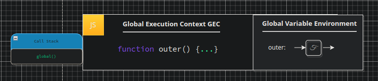
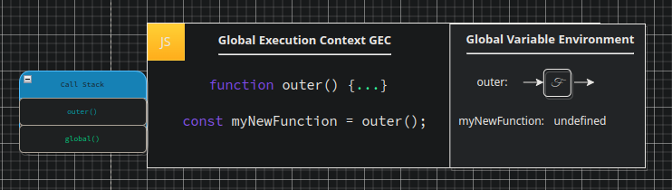
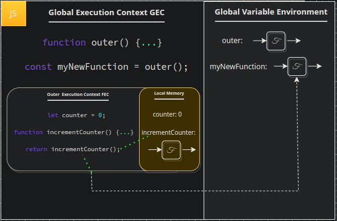
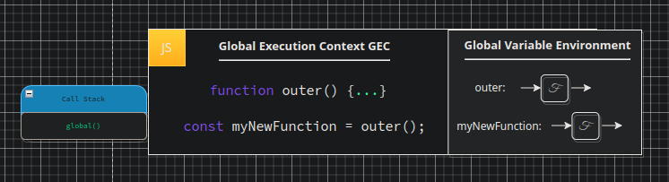
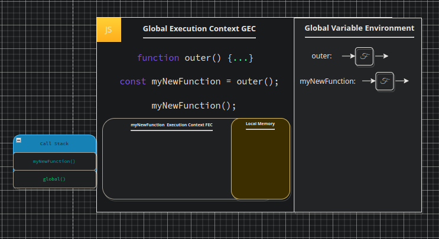
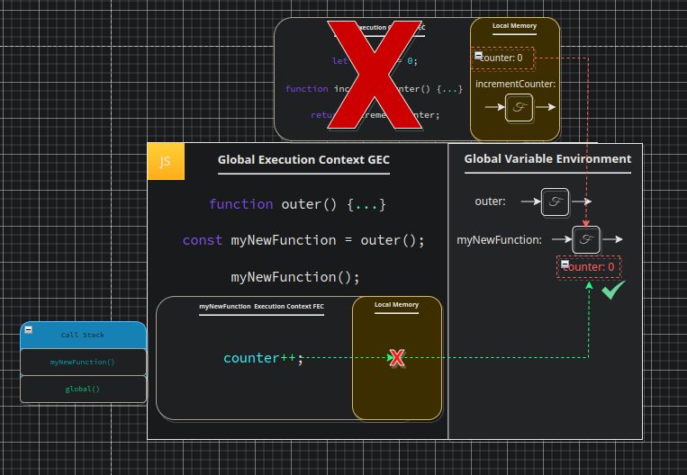
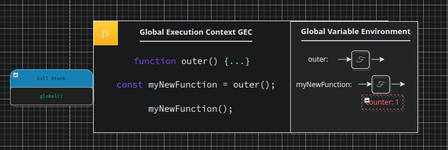
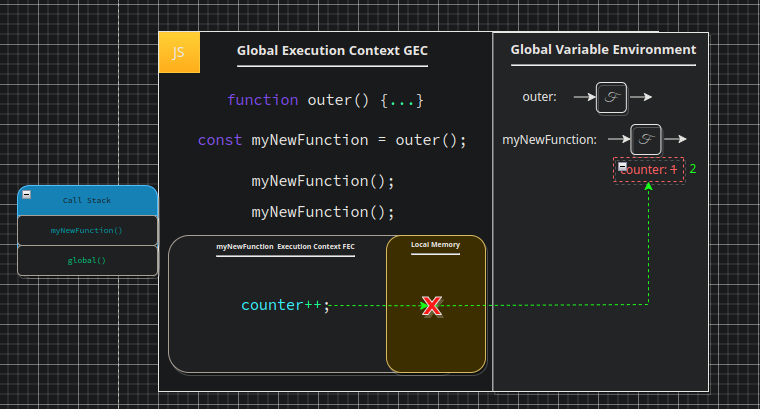
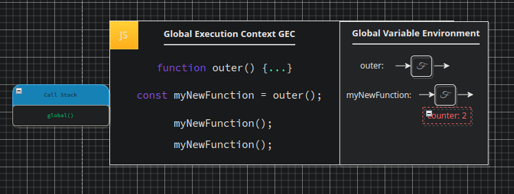

# Function Backpacks

Just a little more and then we will get back into `Node`, it is important however that we have a good understanding of the fundamentals, we will repeat a lot of these concepts in later chapters, however, we will not go into as greater detail as the previous knowledge will be assumed from these chapters. We have defined our `function backpacks` in the previous chapter, but to recap; when we return a `function` from within another `function` in JS we have access to any data which surrounds the function. This means that we can have a variable within the `outer` function which is used within our inner `function`. This works as the surrounding data is exported with our `function` on a little `backpack` of data which is attached to the `function definition`. This is checked prior to JS checking the `GEC` for a variable which is not found within the context of the exported function, should the function be implemented as we would expect we should expect the variable to be found here.

In the next section we are going to step through another piece of code and follow it's execution, however, unlike our previous examples I am going to present these to you in a different format. I believe that sometimes viewing something from a different perspective can assist in developing a more three dimensional model of the processes which are occurring. Henceforth, I will be presenting this in small sections. These sections will be followed by a diagram of the process to that point in the execution, I will also include the call stack to the left

 

<pre>
<code>
function outer () {
    let counter = 0;
    function incrementCounter () {
        counter++;
    }
    return incrementCounter();
}
const myNewFunction = outer();
myNewFunction();
myNewFunction();
</code>
</pre>

 

Just as before, we start with a declaration of our `outer` function saving a reference to the code into our `GVE` set on the label `outer`.

 

 

Next we declare a constant, assigning it the `evaluated value` of `outer`. We know at this point `outer` is added to the `call stack` and we enter a new `FEC`. At this point in our execution `myNewFunction` has no value in memory, it is undefined, and will not attain a value until we have evaluated the value of our function.

 

 

So lets now enter our `outer FEC`. We have no parameters passed in to set. Hence, the first line we execute is to save a value `0` on the label `counter` in `local memory`. We also save our `incrementCounter` function into `local memory`. Lastly, we return `incrementCounter` from our `FEC` to the `GEC`, note that we are returning the label which has been set in `local memory`, JS will perform a lookup and return the value associated to said label.

 

 

At this point our `FEC` is destroyed, all `local memory` lost, and our `outer` function is popped from our `call stack`. At this point we have `myNewFunction` set with the value returned from the `outer` function which happens to in turn be the function `incrementCounter`. It is important to understand that the label we are referring to `myNewFunction` in the `GEC` is now the code from the function return originally assigned to the label within our `FEC`s local memory of `incrementCounter`.

 

 

Our next line invokes `myNewFunction`. As we just discussed, this is now referencing the code originally set on the label `incrementCounter`. It is not pointing back to the function in code, it is set within the `GEC` to the label `myNewFunction`, when we refer to `myNewFunction` now we are referring to our `incrementCounter` code. Of course, invoking this function adds it to our `call stack` and thus we enter a new `FEC`.

 

 

Inside of this `FEC` we have but one line of code to execute. Whilst your eyes may trace back up the code to the `incrementCounter` to find the code we are about to run recall that the JS engine is not doing this, it is simply accessing our label in memory of which we already have our code saved as an `argument`. Hence, we run inside our `FEC`: `counter++;`, JS will therefore look at the label `counter` and attempt to find a value for it. The first place the JS engine will check is within the `local memory` of the current `FEC`. In this case the `counter` label does not exist within the `local memory` of our `FEC` so our lookup fails. If we check our `call stack` we would expect JS to check the `GVE` next as that is the next context down our stack, however, we know it does not exist here either. So, how does JS deal with this? how could it be that we are able to define and invoke a function which has access to a variable that we apparently do not have access to? all is not quite what it seems. What we are missing from this puzzle is the intermediary step JS takes prior to checking our `GVE`. This is our `backpack`, within which all surrounding data needed to run the function are exported with the function itself as part of the function definition. In the below diagram the cross shows that this is our previously destroyed `execution context`, we are not resurrecting the `FEC` here, nor are we fetching data from the `local memory` of this previously run `FEC`, this is simply to demonstrate where the data originally came from. When we returned our `incrementCounter` function from this `FEC` we received our data pack as part of it's definition, it has sat on that definition ever since, within our `GVE`, we can only access this when we run the function code itself. Consequently when JS performs our lookup for the counter label, it doesn't find it in `local memory` of our `myNewFunction FEC` but it DOES find it within the function definition sitting within out `GVE`.

 

 

So, back on track. JS checks our function definition (or "`backpack`"), what does it find? it finds our `counter` with value `0`, in which case it runs our `increment` on `counter` incrementing it's value by `1` after which our function implicitly returns, exiting our `FEC` and popping our `myNewFunction` call from the `call stack`.

 

 

So now we are back in the `GEC` where we have a second call to the function `myNewFunction`. Just as before this results in `myNewFunction` being pushed unto the `call stack` and a brand new `FEC` is created. Within our `GEC` we run the line `counter++;`. JS looks up our `counter` label in `local memory`, it is unable to find it, it checks the function definition `backpack` in the `GVE` and increments it's value by `1`. Take a moment to recognise the significance of this, we have gone from having functions that only have a local memory of which is destroyed upon exiting the function, losing all data stored within it other than that which we return out, to having a persistent memory across multiple function calls. Yet once again we are missing a piece of the puzzle here, how does JS grab this data and return it out with the function definition? It does this the moment we declare `incrementCounter`, at this moment we are literally saving in the computers memory (in the store of functions and data) a label with the entirety of our code of this function. Should we log this function to the console, we would see the whole code of it along with the definition data via a hidden property. This is the `[scope]` property which links to the location where all the surrounding data the function utilises is stored. This `backpack` of data is stored permanently, unless we overwrite the function definition itself it is not going to be deleted or removed unlike our function execution contexts, the caveat here is that this data is not accessible by any means other than the function call itself, you may think this a weakness, but think about it for a moment. JS does not support private values, unlike languages such as `C++` or `Java` where we have the private and public keywords for access control, but... using this `backpack` we can somewhat emulate this behaviour, this backpacks data is private, only accessible from within the function, hence, we now have a means of privatising functions and variables to within a private scope.

 

 

Lets finish our example. We know at this point we have completed our function execution, it follows that our execution context will be destroyed, the function popped from the `call stack` and we will return to our `GEC` at which point there is no more code to run and we end with our context state as follows:

 

 

---

[<< prev](./8_callbacks.md) | [next >>](./10_synchronicity.md)

