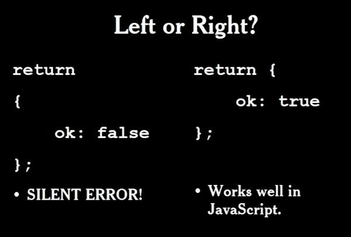
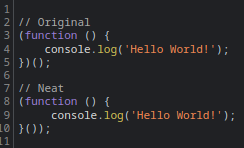

# JS - Rules for Improvement

There is no easy route to programming, no magic formulae which will make you an expert engineer, but there are methods which can assist. However, learning as much as you can will help, experimenting will help, and understanding the rules will help. As such, here are some of the fast and hard rules which you can apply to improve your code, there are exceptions to the rules, and not everyone may agree with them, but these are rules which I have found helpful for writing cleaner code, that is, code which is readable, maintainable, and legible. Legibility and readability are two differing concepts, code may be readable but illegible, legibility is to do with how easy code is to understand, generally we want a balance of the two. As such, it is important to understand that these rules are based on a premise proposed by [Douglas Crockford](https://www.amazon.co.uk/JavaScript-language-Pristine-Revision-Chinese/dp/B0097CON2S/ref=sr_1_2?crid=AX7L002T333P&keywords=Douglas+Crockford&qid=1667852238&sprefix=douglas+crockford%2Caps%2C352&sr=8-2) to paraphrase; "<em>JS has some good parts, some bad parts, and some awful parts</em>" the idea being to avoid the awful and bad parts and only use the good parts, much like building anything else, constructing artefacts from bad parts will lead to a bad artefact.

1. Avoid Global Variables - Possibly the worst part of JS is it's dependence on Global Variables, they make it difficult to run independent sub-programs (pretty much the whole premise of functional programming), atop of this JS automatically creates a global variable if they are declared without a keyword. This can create bugs which are hard to trace and debug, not only this but it can create unseen connections throughout any point of the app. Avoid declaring global variables.

2. Declare Variables at The Top - In most C-like languages we declare variables within our block scopes. This is because most C-like languages privatize our variables to our scopes. Whilst JS borrows the C block syntax it does not have a block scope, due to this it is better to declare variables at the top of our functions in JS rather than the C standard of declaring them at the site of their first use. This ties into our execution contexts when running functions as JS does have function scopes. Declare variables at the top of your functions.

3. Use Semicolons - As many beginners know JS has a mechanism for automatically inserting semicolons at the end of a statement. This means that you don't actually "need" a semicolon for JS to run, however, this mechanism is unreliable and can mask larger errors, never rely on it. It may insert semicolons in places we don't want them, it can even void some statements causing them to return "undefined". Don't rely on semicolon insertion. Use Semicolons.

4. Avoid Reserved Words - JS has many reserved words, some of which aren't even used in the language, but, we should avoid using them in our code where possible. This is because when we use these words as keys  they must be quoted, hence, we render ourselves unable to use dot syntax. Avoid Reserved Words.

5. Be wary of `typeof` - The `typeof` operator returns a string which identifies the type of it it's operand, as the name suggests. If we conduct `typeof null` however, notice that the value returned is `object`. A better test for `null` is to use the equality operator `===`. Typeof also cannot distinguish between `null` and `objects`. In such a case you need to combine checking the `object` value (Objects are truthy values) and the expectant `null` value as `null` is falsy. `NaN` is also problematic as `NaN` is indeed a number, an `Object` is of type function and so on. Some implementations may also disagree on the type of `regex` objects. Be wary when using `typeof`.

6. Always Provide the Radix to parseInt - `ParseInt` is a useful utility, it converts a string into an integer. It can take a number string such as `1` or a string including a number such as `1 cm`. It is worth noting that the function itself does not take any note of the additional text, and it stops parsing at the first nondigit. If the first character of a string is `0` it will be evaluated in base `8` rather than the default base `10` unless we manually provide the `radix`. This is particularly problematic when parsing dates. Thus, to avoid problems, always provide the `radix` to `parseInt`.

7. Ensure Both Operands are Numbers - In JS the concatenation operator is also used for mathematical additions. This means that if one operand is an empty string we can unintentionally concatenate rather than sum our arguments.  Anytime you intend to add, ensure that both operands are numbers.

8. Convert Floating Points - floating point arithmetic is prone to bugs but is a necessity in the IEEE standard for binary floating point arithmetic. It is a good standard, suited to many applications, but we must remember to scale these numbers when we need accuracy. When dealing with currency we can therefore multiply our values by `100`, we can then accurately sum our values prior to converting them back by dividing by `100`.

9. Use `isFinite` - We often need to determine if an operation is `NaN`. We determined that `NaN` is a number, therefore it can be used in calculations, however, any output of a calculation involving `NaN` will also be `NaN`. We cannot use `typeof` as it will return `number` for `NaN`, `NaN` is also not equal to itself. We can use the `isNaN` function to determine if our value is `NaN`, however, it is better to use `isFinite` to determine whether a value is usable as a number because it not only rejects `NaN` but also rejects `infinity`. You may want to still check if the value is a number however as if the operand is not a number `isFinite` will attempt to convert it to one.

10. Don't Change Global Values - There are a number of predetermined `falsy` values in JS. These are global variables but they are not constants, hence, they can have their values changed. It should need no explanation why this is a bad idea. Do not change these values.

11. Test For Membership with `hasOwnProperty` - In some cases you will find that you need to loop over objects to perform some task. In a C-like language we could simply iterate over the values and conduct our operations until we reach the end. In JS however, Objects are never truly empty due to the prototype chain, therefore, we may run into unexpected results especially when combined with the concatenation behaviour when using the `+` operand on strings. We can use `hasOwnProperty` to check for membership ensuring that we have a property before we perform our operations.

12. Avoid Evil Operands `==` and `!=` - In JS we have the operands `===` and `!==`, you may know these as exact equality operators. You may also have seen the evil twins mentioned above. These effectively do the same thing, that is, when the operands are of the same `type`. However, if the types are not the same they attempt to `coerce` the values, this can be complicated and unmemorable, thus we should simply avoid using them.

13. Avoid `with` Statement - The `with` statement was originally intended as a shorthand for accessing Object properties. Avoid it, the results are often unpredictable, it is known to vary not only between runnings of the program but within a single instance of a running program itself. Simply its existence in the language significantly slows down JS. Avoid the `with` statement.

14. `Eval` is `evil` - `Eval` can be used to pass code to the JS compiler for execution. It is misused, hard to read, slower to execute due to it's need to run the `compiler`, it compromises security due to the amount of authority it grants. Need I say more? `Eval` is pure `evil`, avoid it.

15. Don't Pass Strings to `setTimeout` and `setInterval` - When using these functions with a string argument they run as an alternate form of `eval`. As we just determined, `eval` is `evil`. Don't pass strings to `setTimeout` or `setInterval`.

16. Don't use `Continue` - While it may be useful when writing `Assembly` you are better off without it. Due to it's jumping back to the top of a loop it makes our code smell. It can be difficult to follow, hard to read, and just bad practice. Don't use `continue`.

17. Avoid Intentional Fallthroughs - Whilst I am not entirely sold on this myself, I have used these fairly recently, I can see why others dislike them. Whilst there is nothing immediately obviously bad about using intentional fallthroughs in `switch` statements, it can make debugging more difficult if you end up with `unintentional` fallthroughs i.e. fallthroughs caused by a missing `break` or `return`. `Douglas Crockford` would say that the worst features are not the ones which are obviously dangerous, but the ones which are an attractive nuisance, those which are both useful and dangerous. In this case, we like the `fallthrough` because it is compact, but it is also a danger for creating hard to spot code smells. I have come to the conclusion that these are likely better to avoid entirely, however, if you must use them, determine some strict rules for their use. For example, have a rule that when a fallthrough is used every other statement MUST have a return unless it is falling to the default or determine that a `break` must always occur within each statement. These rules can make it easier to detect unintentional fallthroughs, though they are not foolproof. Another issue with this is one that `Douglas Crockford` fell victim to himself, if we have fallthroughs there is a chance that when updating our code the fallthroughs will change, if we have a number of fallthroughs this can be difficult to spot. As such, I would recommend only using fallthroughs in only very simple switch statements, for instance in a case where I recently created a function which passed a string operator to perform some math with, anything larger than two statements falling through to a single case should likely be re-thought, especially if it is likely to be added to in the future.

18. Keep Blocks Consistent - BlockLess statements are another `evil` in JS. They are often used by `python` buffs or those coming from languages which lack the use of `curlys` for determining project structure. However, in JS these cannot be relied on, programs can run unpredictably and blocks may not end or start where you expect when using blockless statements. `Blocks` make it easier to get your structure right, they have a clear beginning and end, and we can trace them in our code editor by seeing the curly pairs. At te very least keep your use of blocks consistent, but I would recommend never using blockless statements at all.

19. Avoid shorthand `++/--` operators - These operators can be too cryptic. We can instead be more explicit reducing bugs and creating a cleaner coding style. Yes, it means writing a few more characters, but, when you consider the fact that these two operators are often the cause of `buffer overrun` bugs which cause serious security vulnerabilities it is worth the trade off to move forward without them.

20. Use Global Abatement - As mentioned in our previous rules you should absolutely avoid `Global Variables`. However,
sometimes you may find they are a necessary evil, not often, but sometimes. `Global Abatement` allows us to comparementised
our application privatising our `globals` into our application scope. This is somewhat similar to namespacing an app
in other languages. `Global Abatement` is the act of reducing our global footprint to a single name. We do so by
creating an object which contains our application.

21. Be sparing with Bitwise Operators - If you have come from a lower level language you will likely be familiar
with `Bitwise Operators`. Usually bitwise operators work with integers, however, JS doesn't have integers, so
the bitwise operators have to convert the double floating point numbers into integers. It mus then also
convert them back once the operation completes. In lower level languages these operators are very close to
the hardware, and thus operate very quickly, however, in JS they are much further from the hardware and thus
actually very slow. You shouldn't need to do bitwise calculations often in JS, but if you do try to use them
sparingly.

22. Prefer Function Expressions - In JS we have both `function statements` and `function expressions`. Both are
similar:
Expressions make it clear that our function is a value attached to a variable. Statements are also subject to hoisting, this can lead to sloppy code as it relaxes the requirement for our function to be declared before it is used. Another important note is that most browsers allow function statements inside if statements, however, their interpreters interpretation of the code may vary accross implementations, we also cannot set an expression as the first part of our statement because the grammar assumes a function statement to also be preceded by the keyword `function`.

| Function Statement | Function Expression |
| --- | --- |
| <code>function foo() {} </code> | <code>const foo = function foo () {}</code> |

23. Avoid Typed Wrappers - Typed wrappers such as `new Boolean()`, `new Object`, `new Array` should be avoided. if you create an Object use `{}`, an array use `[]`, for typed wrappers such as `Boolean` outright avoid using them, they produce an Object that has a `valueOf` method which returns the wrapped value. This can lead to confusion and is a totally unnecessary additional step.

24. Avoid New - yes, that's right, the `new` keyword, avoid it. Behind the scenes JS is a prototypal language, not a class based language, the class based syntax is nothing but syntactic sugar, but can also lead to problems. The `new` operator creates a new `object` which inherits from the operands prototype member. It then calls the operand, binding the created object to the `this` keyword. This gives the operand a chance to customise the new object before it is returned. You had better have provided this as a `constructor` function. The problem occurs if you forget the `new` keyword, in this case you will instead get can ordinary function call, since this is now no longer using the `new` operator there is not object created and nothing to bind `this` to, thus `this` is instead bound to the `global` object. This means whenever you initialize a new object by invoking the function you will be instead interacting with `global` variables. The JS convention to avoid this is to capitalize any functions that are to be used with the `new`. This gives a visual cue should any issues arise. There are no compiler-time warnings for this issue, nor runtime warning so it can be incredibly problematic to debug. It is far better to simply avoid using `new` at all.

25. Don't use Void - JS actually has no `void` type. In JS `void` returns `undefined`, it is incredibly confusing. don't do it.

26. Hide ugly features - JS can be beautiful, but it's low barrier to entry also means it suffers from a similar problem that is often complained about in `php`. It is far too easy to write ugly code. JS is very accepting, which means it can be easy to write code that works, but not so much when it comes to writing code that is maintainable and beautiful. We can hide a lot of the ugly through various methods, we can `augment` functions for instance to hide ugly prototype calls. This is the true power of the JS prototype system. It allows us to make the language far more expressive by augmenting parts to suite our needs. This is possible because every object which uses this prototype chain will inherit the methods we define on the prototype of our basic types.

 

<pre>
Function.prototype.method = function (name, func) {
    this.prototype[name] = func;
    return this;
}
</pre>

 

27. Protect Against Mixed Libraries - Mixing libraries can cause issue. In other languages we have separate namespaces to defend against this, in JS however we need to protect against this. In our previous rule we augmented the `Function` basic type. However, another library may have already augmented this with the same method name we used, this is because prototypes are public structures and thus subject to changes. One defensive technique we can utilise is a basic check in which we only create our function if it does not already exist, of course this means we wont get our function if there is a function of the same name already.

 

<pre>
Function.prototype.method = function (name, func) {
    if (!this.prototype[name]) {
        this.prototype[name] = func;
        return this;
    }
}
</pre>

 

28. Use `null` for purposefully valueless references - When we code in JS we sometimes have cases where we want to leave a value undefined. The problem here is that the system applied undefined, whilst we can assign it ourselves this can lead to confusion in our codebase should we forget to create a variable. It is far better to leave `undefined` as a value only assigned by the system and instead use `null` ourselves. Remember, that `undefined` is itself a value, whilst `null` is the abscence of value. By doing this we know that anytime we see `undefined` in our output we know that it is something which is missing a definition, not something we have purposefully left without value.

29. Avoid the use the `BigInt` Type for large numbers - JS originally had only one number type, this meant everything in JS is handled as a floating point number, even those which do not explicitly have decimals. Floating point is great for handling calculations for many applications, but, we can run into issues when we get into larger numbers as floating points are not precise enough. JS recently introduce the `BigInt` type to allow a native solution for dealing with large numbers. We can use the `BigInt` type by adding `n` to the end of a number or by explicitly using the `BigInt` constructor. Keep in mind that `BigInt` will never display a decimal number, `BigInts` are not strictly equal to Numbers. Because of these weaknesses I would avoid using `BigInt` unless you really need to. There are other solutions to dealing with large numbers which have fewer side effects in our code. I also do not like the fact it encourages the use of our loose equality operators. Don't use `BigInt` if you can help it.

30. Use Strict Modes - Strict modes are available in most high level languages and JS is no exception. Whether using `vanilla`, `typescript`, `node`, `react`, or any other library or framework, get used to using `strict mode`. Strict mode increases the aggression of our error checking, reporting errors that might otherwise go unreported. This encourages us to write better code and enforces some rules which help to prevent particular bugs which may occur in non-strict modes.

31. Put your curly braces on the right - This one is taken straight from one of [Douglas Crockford's](https://frontendmasters.com/courses/good-parts-javascript-web/) talks on JavaScript, disclaimer I am one who thinks this is the prettier method for braces in most languages, but in JS we actually have a reason for this. In JS we can have a function which returns an object (a constructor), we also have a `object literal` in which we are able to return a new `object`, so far so good. The problem occurs that if we use our `object literal` with braces on the left rather than on the right we get a silent error. This means that our function at runtime will return `undefined` rather than our expectant object. This can be very hard to debug and cause productivity to drop, this is due to the automatic semicolon insertion.

    

32. Use JSLint - JSLint is a tool originally created by [Douglas Crockford](https://www.amazon.co.uk/JavaScript-Good-Parts-Douglas-Crockford/dp/0596517742) use it. It will hold your code to the standard you should be coding at allowing you to enjoy the good parts of JS whilst ignoring the bad.

33. Wrap your IIFEs - This is an idea I was only actually introduced to very recently, literally the day of writing this, but I think it is an absolutely beautiful improvement to the readability of JS. I love IIFEs, they are useful in so many places, especially when we want a default returned from a function we are only ever going to use in that one place, we just want the result, and we want it now. However, the IIFE always has to have the invocation parentheses hanging off the edge, this can look somewhat ugly, and can cause programmers less familiar with the codebase to do a double take. Instead we can wrap the whole expression in braces to convey the information that this is indeed an IIFE.

    

